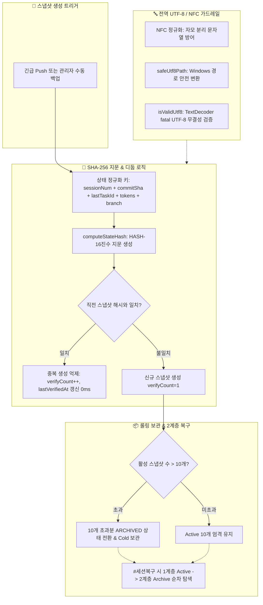

# 🛡️ 세션 DR 스냅샷 디둡·롤링 아카이빙 및 UTF-8 인코딩 가드레일 해설 (15-13)

> **문서 식별자**: `DOC-15-13-SESSION-DR-DEDUP-AND-UTF8-GUARD`  
> **최초 작성일**: `2026-09-24`  
> **최종 수정일**: `2026-09-24`  
> **작성자**: AI Agent (Session-0012 / Task-0018)  
> **상태**: `APPROVED` (학습 문서 승인 완료)

---

## 1. 개요 및 배경

세션 재해복구(DR) 체계에서 긴급 Push 시마다 생성되는 스냅샷 파일(JSON/MD)이 무제한 누적되거나 내용 변경 없이 중복 생성되면 **스토리지 낭비 및 복구 타임라인 가독성 저하**가 발생합니다. 또한 Windows 개발환경에서 한글 파일명 및 문서 본문이 CP949나 NFD(자모분리)로 왜곡되는 위험이 존재합니다.

본 문서는 **SHA-256 상태 지문 디둡(Deduplication)**, **10개 롤링 보관 및 Cold Storage 2계층 복구**, **전역 UTF-8/NFC 인코딩 영구 방어 가드레일**의 핵심 설계 원리와 구현 패턴을 해설합니다.

---

## 2. 핵심 아키텍처 패턴 해설



---

## 3. 핵심 도메인 코드 분석

### 3.1 SHA-256 지문 기반 중복 억제 (Deduplication)
```typescript
const stateHash = SessionDisasterRecoveryService.computeStateHash({
  sessionNum: newSnapshotParams.sessionNum,
  latestCommitSha: newSnapshotParams.latestCommitSha,
  lastTaskId: newSnapshotParams.lastTaskId,
  totalContextTokens: newSnapshotParams.totalContextTokens,
  branch: newSnapshotParams.branch,
});

const existingIndex = existingSnapshots.findIndex(
  (s) => s.stateHash === stateHash && s.status === 'PENDING_RECOVERY'
);

if (existingIndex !== -1) {
  // 중복 생성 억제: 메타데이터 카운트만 증가
  const existing = existingSnapshots[existingIndex];
  const updated: SessionSnapshot = {
    ...existing,
    verifyCount: (existing.verifyCount || 1) + 1,
    lastVerifiedAt: new Date().toISOString(),
    isDeduplicated: true,
  };
  return { updatedSnapshots, resultSnapshot: updated, isDeduplicated: true };
}
```

### 3.2 2계층 스냅샷 복구 전략
- **1계층 (Active Pool)**: 최근 10개 활성 스냅샷에서 대상 ID 즉시 복구.
- **2계층 (Cold Archive Pool)**: 활성 풀에 없는 오래된 스냅샷은 아카이브 저장소(`ARCHIVED`)에서 자동 탐색하여 복구함으로써 영구적 복원 무결성을 보장.

### 3.3 NFC 정규화 및 UTF-8 가드레일
```typescript
export class Utf8EncodingGuardService {
  public static normalizeNfc(input: string): string {
    if (!input) return '';
    return input.normalize('NFC');
  }

  public static safeUtf8Path(filePath: string): string {
    if (!filePath) return '';
    const normalized = path.normalize(filePath).replace(/\\/g, '/');
    return Utf8EncodingGuardService.normalizeNfc(normalized);
  }
}
```

---

## 4. 편집 이력

| 버전 | 일자 | 변경 내용 | 작성자 |
| :--- | :--- | :--- | :--- |
| `v1.0.0` | `2026-09-24` | 세션 DR 스냅샷 디둡, 롤링 아카이빙 및 전역 UTF-8 가드레일 기술 해설 신규 작성 | AI Agent |
