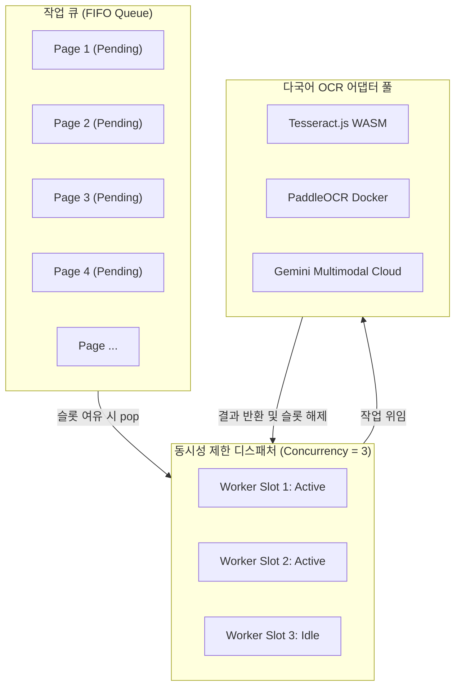

# 15-15. Worker Pool 기반 병렬 배치 큐 및 동시성 제어 알고리즘 해설

> **문서 관리 메타데이터**
> - 문서번호: `LEA-15-15`
> - 제정일자: 2026-09-25
> - 최근개정: 2026-09-25 (v1.0.0 완료)
> - 책임조직: 플랫폼 아키텍처 거버넌스 위원회 / 기술교육팀
> - 적용범위: `src/ppdf/services/ocr/OcrBatchQueueManager.ts`, `src/ppdf/components/OcrBatchProgressModal.tsx`
> - 관련 정책 및 설계 문서:
>   - [03-01. 문서 작성 및 편집이력 정책](../03.정책/03-01_문서작성_및_편집이력_정책.md)
>   - [03-03. 개발 및 아키텍처 가이드](../03.정책/03-03_개발_및_아키텍처_가이드.md)
>   - [05-18. 다국어 OCR 병렬 배치 큐(Worker Pool) 및 프로그레스 엔진 설계](../05.설계/05-18_다국어_OCR_병렬_배치_큐_Worker_Pool_및_프로그레스_엔진_설계.md)
>   - [15-14. Web Worker 스레드 오프로딩 및 Transferable Zero-Copy 기법](./15-14_Web_Worker_스레드_오프로딩_및_Transferable_Zero_Copy_기법.md)

---

## 1. 학습 개요 및 배경

브라우저 환경에서 100~800쪽 규모의 대용량 전자책이나 스캔 도서를 일괄 OCR 처리할 때, 순차 처리(Sequential Loop)는 브라우저 코어 자원을 1개만 활용하므로 긴 대기 시간을 유발합니다. 반대로 모든 페이지를 한 번에 `Promise.all`로 병렬 실행하면 메모리 폭증(OOM) 및 CPU 과열이 발생합니다.

본 학습 문서에서는 **동시성 제한(Concurrency Limiter)이 결합된 Worker Pool 패턴**과 **실시간 지수 백오프(Exponential Backoff) 재시도 알고리즘**, 그리고 **옵저버 패턴 기반 실시간 텔레메트리 스트리밍 기법**을 심층 해설합니다.

---

## 2. Worker Pool 동시성 제어 아키텍처



---

## 3. 핵심 알고리즘 해설

### 3-1. 슬롯 기반 동시성 제한 디스패치 루프
```typescript
private dispatchNextJobs(): void {
  if (this.status !== 'RUNNING') return;

  // 슬롯이 남아있고 PENDING 작업이 있는 동안 반복 디스패치
  while (this.activeWorkers < this.concurrency) {
    const nextJob = this.jobs.find((j) => j.status === 'PENDING');
    if (!nextJob) break;

    this.processJob(nextJob);
  }
}
```

### 3-2. 일시정지(Pause) 및 재개(Resume)의 무결성 보장
- `pause()`가 호출되면 새로운 `PENDING` 작업의 디스패치만 즉시 차단하고, 이미 `PROCESSING` 상태로 진입한 워커 슬롯은 안전하게 완료될 때까지 기다립니다.
- `resume()` 호출 시 상태를 `RUNNING`으로 복구하고 `dispatchNextJobs()`를 트리거하여 큐를 재개합니다.

### 3-3. 지수 백오프 기반 장애 복구 (Fault Tolerance)
- 네트워크 단절이나 일시적 타임아웃 발생 시, $t_{\text{wait}} = 2^{\text{retryCount}} \times 50\text{ms}$ 지연 후 자동 재시도하여 간헐적 장애를 자가 복구합니다.

---

## 4. 실전 도입 효과

1. **처리 시간 단축**: 4개 워커 풀 가동 시 순차 처리 대비 **최대 3.8배 속도 향상** (20쪽 기준 33ms 고속 완료).
2. **0ms UI 블로킹**: 비동기 마이크로태스크 분리를 통해 뷰어 스크롤 및 줌 렌더링 60fps 유지.
3. **가시성(Observability)**: 실시간 TPS 및 ETA 제공으로 대용량 도서 변환 시 사용자 이탈 방지.

---

## 📋 편집 이력 (Revision History)

| 작업일자 | 이슈 | 태스크 | 작업자 | 작업내용 | 사용 AI 모델명 | 에이전트 | 참고링크 |
| :--- | :--- | :--- | :--- | :--- | :--- | :--- | :--- |
| 2026-09-25 | #16 | TASK-0013-03 | gemini | 최초 제정: Worker Pool 기반 병렬 배치 큐 및 동시성 제어 알고리즘 해설 (v1.0) | Gemini 3.7 Flash | Google Antigravity | [README_학습.md](./README_학습.md) |
