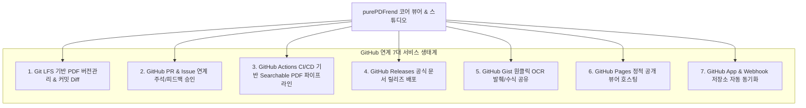
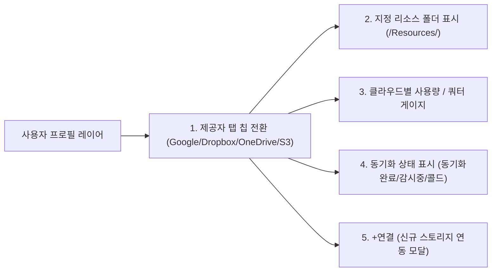
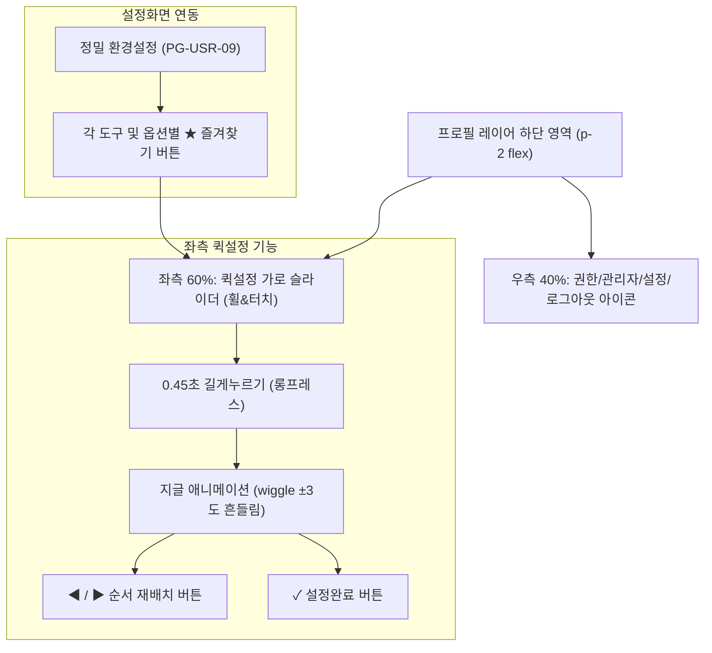

# [학습 및 백로그] GitHub 연계 서비스 아이디어 전개 및 멀티 클라우드 리소스 스토리지 거버넌스 아키텍처 (15-16)

> **문서 번호**: DOC-15-학습-15-16  
> **관련 태스크**: `[TASK-0018-01]`  
> **버전**: v1.0.0 (2026-09-30)  
> **작성자**: purePDFrend 시스템 아키텍처팀  
> **상태**: 승인 및 백로그 등록 완료  

---

## 💡 1. GitHub 연계 기반 서비스 혁신 아이디어 전개 (7대 핵심 서비스)

GitHub의 강력한 버전 관리, 협업, 자동화 인프라를 purePDFrend에 결합하여 단순한 클라우드 뷰어를 넘어 **"엔지니어 및 문서 연구자를 위한 GitOps 문서 플랫폼"**으로 도약하기 위한 7대 서비스 아이디어를 도출합니다.

### 1-1. Git-backed PDF Document Version Control & Git LFS (버전관리 및 변경 이력 추적)
- **개념**: PDF 바이너리는 `Git LFS(Large File Storage)`로 관리하고, 주석(Annotations), 북마크, 메타데이터는 JSON/XFDF 텍스트로 저장소에 커밋합니다.
- **가치**: 문서가 수정될 때마다 SHA 해시 기반의 명확한 커밋 이력이 생성되며, 과거 특정 시점의 문서와 주석 상태로의 무손실 롤백(Time-Travel)이 가능합니다.

### 1-2. GitHub Issues & Pull Requests 연계 문서 검토/승인 워크플로 (Document Review GitOps)
- **개념**: PDF 뷰어에서 특정 영역을 드래그하여 남긴 교정 주석이나 하이라이트를 GitHub Issue 또는 Pull Request의 Review Comment로 원클릭 발행합니다.
- **가치**: 법무 검토, 특허 심사, 논문 리뷰 시 여러 검토자의 피드백을 PR 머지(Merge) 승인 절차와 동일하게 관리할 수 있습니다.

### 1-3. GitHub Actions CI/CD 기반 Searchable PDF 자동 빌드 파이프라인
- **개념**: 스캔 PDF나 이미지가 레포지토리에 푸시되면, GitHub Actions Runner에서 Tesseract/OCR 백그라운드 작업을 실행하여 **"투명 텍스트 레이어가 임베딩된 Searchable PDF"**를 자동 컴파일하고 아티팩트로 저장합니다.
- **가치**: 사용자의 로컬/클라우드 자원을 절약하고 표준 규격(ISO 32000-2, PDF/A) 적합성 검증을 무인 자동화합니다.

### 1-4. GitHub Releases 연계 공식 문서 버전 배포 및 변경 로그 자동 생성
- **개념**: 계약서 최종본, 전자출원 특허명세서, 사내 규격집이 확정되면 태그(`v1.0.0`)와 함께 GitHub Release에 자동 업로드하고 변경 요약(Changelog)을 배포합니다.
- **가치**: 위변조 불가한 불변(Immutable) 배포 링크를 외부 이해관계자에게 제공합니다.

### 1-5. GitHub Gist 연동 원클릭 OCR 발췌 텍스트, 표, 수식 스니펫 공유
- **개념**: PDF 뷰어에서 OCR로 인식된 표(Markdown Table), LaTeX 수식, 코드 블록을 클릭 한 번으로 사용자의 GitHub Secret/Public Gist로 전송하여 공유 링크를 즉시 생성합니다.
- **가치**: 개발자/연구자가 논문이나 기술문서의 코드를 재타이핑 없이 신속히 스크랩하고 공유할 수 있습니다.

### 1-6. GitHub Pages 정적 열람 모드 뷰어 자동 퍼블리싱
- **개념**: 오픈소스 문서나 공개 매뉴얼을 GitHub Pages 브랜치(`gh-pages`)에 푸시하여 로그인 없이 누구나 웹에서 즉시 볼 수 있는 경량 뷰어 페이지로 호스팅합니다.

### 1-7. Webhook & GitHub App 기반 저장소 양방향 자동 동기화
- **개념**: 지정된 GitHub 레포지토리의 `/docs` 폴더에 새 PDF가 추가되면 웹훅(Webhook)을 통해 purePDFrend 라이브러리에 즉시 자동 등록되고 인덱싱됩니다.

---

## 📑 2. 문서카드 총페이지/열람페이지 통합 표시 UI 아키텍처

- **적용 화면**:
  1. `WireframeTopLayer` 프로필 레이어 내 "최근 읽은 문서" 및 "즐겨찾기" 가로 슬라이더
  2. `PG-USR-03` 홈 대시보드 최근 처리 문서 배너
  3. `PG-USR-05` 문서관리 라이브러리 카드뷰 / 테이블뷰
- **표시 규격**:
  - `M / N 쪽 열람` (예: `655 / 840 쪽`)
  - 열람 진행률 뱃지 병기: `78%`, `완독`
  - 시각적 대비: 현재 열람 페이지는 `text-sky-400 font-bold`, 총 페이지는 `text-slate-300`으로 렌더링하여 정보 인지성을 극대화합니다.

---

## ☁️ 3. 멀티 클라우드 연결 시 UI/UX 고려사항

여러 클라우드 스토리지(Google Drive, OneDrive, Dropbox, AWS S3, GitHub) 동시 연동 시 사용자 혼선을 방지하기 위한 UI 체계를 수립합니다.

1. **상단 수평 스크롤 제공자 탭**: 아이콘(📁, 📦, ☁️, 🪣)과 제공자명을 칩(Chip) 형태로 배치하여 원클릭 전환.
2. **지정 리소스 폴더 명시**: 활성화된 클라우드별 전용 작업 폴더(`currentCloud.resourceFolder`)를 직관적으로 노출.
3. **독립적 사용량 게이지(Progress Bar)**: 각 클라우드의 허용 용량 대비 실사용량(`usedGB / totalGB`) 및 백분율을 시각적 바 게이지로 표현.
4. **일일 OCR 쿼터 미니 게이지와 공존**: 스토리지 용량 우측에 `오늘 OCR: 42/50회`를 병기하여 자원 소비 현황을 한눈에 파악.

---

## ⚡ 4. 프로필 레이어 하단 퀵설정 좌우 분할 및 위치설정 아키텍처

사용자 피드백을 100% 반영하여 설정/로그아웃 영역의 과밀도를 해소하고 사용 빈도가 높은 설정을 바로 조작할 수 있도록 설계합니다.

### 4-1. 60:40 좌우 분할 구조
- **좌측 (약 60%)**: 퀵설정 가로 슬라이드 스크롤 바. 개수 제한 부담 없이 다양한 퀵 액션을 가로로 스크롤하여 탐색.
- **우측 (약 40%)**: 권한 보유 시에만 노출되는 `🤖 에이전트 서비스` + `🛠 관리자 서비스` + `⚙ 정밀 환경설정` + `🚪 로그아웃`.

### 4-2. 롱프레스(Long-Press) 기반 지글 애니메이션 및 위치 설정
- **인터랙션**: 퀵설정 아이콘을 0.45초 이상 누르고 있으면 편집 모드(`isQuickSettingsEditMode`)로 진입.
- **시각 피드백**: CSS `@keyframes wiggle`을 통해 아이콘이 좌우로 흔들리며 편집 가능 상태임을 표시.
- **위치 이동**: 상단에 나타나는 `◀`, `▶` 버튼을 눌러 인접 아이콘과 자리를 맞바꿈(Swap).
- **설정 완료**: 우측 상단의 `✓ 설정완료` 버튼을 누르면 편집 모드가 종료되고 순서가 로컬 스토리지에 영속화.

### 4-3. 정밀 설정 화면(PG-USR-09)과의 즐겨찾기 연동
- 환경설정 화면의 모든 도구 및 일반 옵션(테마, 첫화면, OCR, 자동저장)에 `★` 즐겨찾기 토글 버튼을 배치.
- 클릭 시 즉시 프로필 레이어 하단 퀵설정 바에 등록/해제되어 일관된 사용자 경험을 제공.

---

## 📌 5. [백로그 상세 정의] 클라우드 리소스 스토리지 거버넌스 및 성능 최적화

사용자가 요청한 백로그 항목을 시스템 아키텍처 수준에서 구체화하여 등록합니다.

### 5-1. [백로그 1] 클라우드 스토리지 전반적 활용 방안 및 규격화
- **ID**: `BL-CLOUD-01`
- **내용**: 클라우드 스토리지를 단순 백업용이 아닌 **"분산 가상 파일 시스템(VFS)"**으로 추상화.
- **대상**: Google Drive API v3, Microsoft Graph (OneDrive), Dropbox API v2, AWS S3 SDK.

### 5-2. [백로그 2] 스토리지 특정 폴더 리소스 전용화 (`/purePDFrend_Resources/`)
- **ID**: `BL-CLOUD-02`
- **내용**:
  - 클라우드 루트 디렉토리를 오염시키지 않고, 사전에 지정된 전용 폴더(예: `/purePDFrend_Resources/`) 내부만을 앱의 샌드박스 작업 공간으로 사용.
  - 하위 구조 규격:
    - `/purePDFrend_Resources/docs/`: 원본 PDF 파일 저장소
    - `/purePDFrend_Resources/annots/`: XFDF / JSON 주석 파일 저장소
    - `/purePDFrend_Resources/ocr_cache/`: 페이지별 OCR 인식 BBox 캐시
    - `/purePDFrend_Resources/exports/`: 워터마크/보안 암호화 처리된 산출물

### 5-3. [백로그 3] 유효 사용량 한도(Quota Cap) 및 초과 예외 처리
- **ID**: `BL-CLOUD-03`
- **내용**:
  - 사용자 플랜별 유효 사용량 한도(예: 무료 2GB, PRO 10GB, Enterprise 무제한)를 강제.
  - **초과 시 예외 처리**:
    - 업로드 시 사전 용량 점검 (`Content-Length` 체크)
    - 90% 도달 시 UI 경고 노출 ("저장 공간 부족 임박")
    - 100% 초과 시 쓰기 차단 및 읽기 전용(Read-Only) 모드로 전환
    - 로컬 다운로드 및 캐시 삭제 유도 팝업 트리거

### 5-4. [백로그 4] 성능 최적화: 인메모리 ArrayBuffer 캐싱 & 브라우저 IndexedDB 하이브리드 캐싱
- **ID**: `BL-CLOUD-04`
- **내용**:
  - **작업 중 성능 극대화**: 네트워크 왕복 지연을 방지하기 위해 열람 중인 활성 페이지와 리소스를 메모리(`ArrayBuffer`/`Blob`)에 로드하여 Zero-Latency 렌더링 달성.
  - **브라우저 로컬 저장소 이원화**:
    - `IndexedDB`: 50MB 이상의 대용량 PDF 청크 및 렌더링된 비트맵 캔버스 캐싱.
    - `LocalStorage`: 사용자 뷰어 설정, 퀵설정 순서, 최근 열람 페이지 메타데이터 저장.
  - **LRU(Least Recently Used) 메모리 가드**: 메모리 사용량이 브라우저 임계치(38MB)를 초과할 경우 비활성 페이지 청크를 자동으로 IndexedDB로 스왑 아웃(Swap-out).

---

## 📈 6. 구현 마일스톤 및 하네스 연계

| 마일스톤 | 대상 기능 | 연계 태스크 | 상태 |
| :--- | :--- | :--- | :--- |
| **Phase 2.1** | WireframeTopLayer 퀵설정 좌우 분할 및 지글 애니메이션 | `[TASK-0018-01]` | **완료** |
| **Phase 2.2** | 문서카드 총페이지/열람페이지 통합 표시 (탑레이어, 대시보드, 라이브러리) | `[TASK-0018-01]` | **완료** |
| **Phase 2.3** | 정밀 설정(PG-USR-09) 전 항목 즐겨찾기(★) 퀵설정 등록 | `[TASK-0018-01]` | **완료** |
| **Phase 3.1** | 멀티 클라우드 리소스 폴더 지정 및 사용량 게이지 UI | `[TASK-0018-01]` | **완료** |
| **Phase 4.1** | [백로그] 클라우드 Quota Cap 초과 예외처리 및 IndexedDB 캐싱 엔진 | `[TASK-0019-01]` | **백로그 등록** |
| **Phase 4.2** | [백로그] GitHub Git Data API & Issue/PR 연동 서비스 개발 | `[TASK-0020-01]` | **백로그 등록** |
