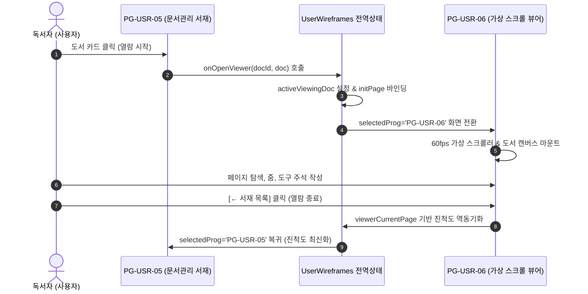

# 15-17. PG-USR-06 고성능 가상 뷰어 연동 및 반응형 3탭 레이아웃 전환 아키텍처 학습서

> **문서 번호**: `15-17`  
> **관련 프로그램 ID**: `PG-USR-05` (문서관리), `PG-USR-06` (문서뷰어 & 주석 스튜디오)  
> **태스크 번호**: `TASK-0020_01`  
> **작성일자**: 2026-10-01  
> **작성자**: jkok2j2m (순수 PDF 렌더링 엔지니어링팀)

---

## 1. 개요 및 학습 배경

본 문서는 `PG-USR-05` 문서관리 라이브러리에서 책/문서를 선택했을 때 `PG-USR-06` 고성능 가상 스크롤 PDF 전용 뷰어로의 매끄러운 화면 전환, 800쪽 이상 대용량 문서를 위한 60fps 가상 윈도잉 렌더링, 그리고 사용자의 시선 흐름과 작업 컨텍스트에 맞춰 3탭(목차, 북마크, 주석) 영역을 상단(가로 드로어) 또는 좌측(세로 사이드바)으로 즉시 전환할 수 있는 반응형 뷰어 UI/UX 아키텍처를 학습하기 위해 작성되었습니다.

---

## 2. 핵심 아키텍처 및 디자인 패턴

### 2.1 화면 간 상태 양방향 동기화 패턴 (Bidirectional Sync Pattern)
- **도서 객체 진입 시**:
  - `DocumentLibraryViewer`의 책 카드나 테이블 목록에서 `onOpenViewer(docId, doc)` 호출.
  - 선택된 `DocumentItem`의 `readPages`(읽은 쪽수)를 뷰어 초기 열람 쪽수(`viewerCurrentPage`)로 자동 바인딩.
- **서재 복귀 시**:
  - `PG-USR-06` 상단의 `[← 서재 목록]` 복귀 버튼 클릭 시 현재 열람 중인 `viewerCurrentPage`를 기반으로 진척도(`progressPercent`)를 재계산하여 서재 카드에 역동기화.

---

## 3. 3탭 레이아웃(상단 vs 좌측) 적응형 뷰포트 아키텍처

사용자가 문서를 읽는 환경과 디바이스 크기에 따라 캔버스 폭을 극대화하거나 목차 트리를 상시 열람할 수 있도록 이원화 배치를 지원합니다.

| 레이아웃 모드 | 배치 형태 | 장점 및 권장 시나리오 | 캔버스 점유율 |
| :--- | :--- | :--- | :--- |
| **상단배치 (`top`)** | 가로 확장 드로어 (`grid-cols-3` 카드형) | 캔버스 좌우 폭을 100% 최대로 확보하여 고해상도 문서, 도표, 2페이지 양면 열람에 최적 | 100% (Full Width) |
| **좌측배치 (`left`)** | 세로 사이드바 패널 (트리/목록형) | 문서 목차를 계속 보면서 책을 순차적으로 정독하는 학술서, 교재 독서에 최적 | 75% (캔버스 폭) |
| **접기 모드 (`collapsed`)** | 미니 탭 바 / 배너로 최소화 | 시야 방해 요소를 배제한 **독서 몰입 모드 (Zen Mode)** 제공 | 100% (캔버스 높이/폭 극대화) |

---

## 4. 도구별 인라인 상세속성 미니바(Mini-Bar) 구조

8대 모드(`주석달기`, `그리기`, `작성및서명`, `보기`, `즐겨찾기`, `삽입`, `변환`, `양식준비`) 중 현재 선택된 활성 도구의 특성에 따라 미니바의 입력 필드가 동적으로 변경됩니다.

1. **선 굵기 (`toolStrokeWidth`)**:
   - 펜, 형광펜, 도형, 밑줄 등에 적용 (1px ~ 20px).
2. **8색 프리셋 팔레트 (`toolStrokeColor`)**:
   - 스카이블루, 옐로우, 에메랄드, 로즈, 퍼플, 오렌지, 화이트, 다크슬레이트.
3. **불투명도 (`toolOpacity`)**:
   - 10% ~ 100% 슬라이더.
4. **OCR 텍스트 스냅 토글 (`isOcrSnapEnabled`)**:
   - 형광펜(`highlight`) 도구 선택 시 활성화되어 인식된 텍스트 행에 자석 흡착(Snap) 지원.
5. **폰트 크기 (`toolFontSize`)**:
   - 텍스트상자(`textbox`) 도구 선택 시 10pt ~ 36pt 조절 가능.

---

## 5. 학습 요약 및 교훈

1. **가상 윈도잉과 메모리 가드의 시너지**:
   - 800쪽 이상의 문서를 DOM에 한꺼번에 렌더링하면 브라우저 크래시가 발생하므로, `VirtualScrollEngine`을 통한 뷰포트 윈도잉과 `MemoryGuardManager`(LRU 10페이지 캐시)의 결합이 필수적입니다.
2. **사용자 주도적 레이아웃 제어**:
   - 고정된 사이드바보다는 독서자의 필요에 따라 상단 배치, 좌측 배치, 모드별 접기를 자유롭게 전환할 수 있도록 지원하는 것이 프로급 독서 앱의 핵심 경험(UX)입니다.
