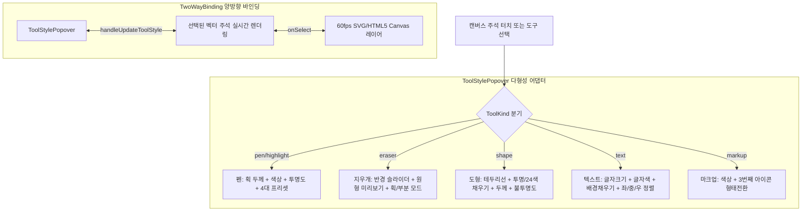

# 15-18. Xodo 벤치마킹 다형성 도구속성 팔레트 및 벡터주석 양방향 바인딩 패턴 해설

> **문서 번호**: `15-18`  
> **태스크 번호**: `[0020_03]`  
> **세션 번호**: `SESSION-0020`  
> **작성 일시**: 2026-10-01  
> **관련 화면**: `PG-USR-06` (문서뷰어 & 주석 스튜디오), `ToolStylePopover.tsx`, `AnnotationActionPopover.tsx`

---

## 1. 배경 및 문제 정의

모바일 및 태블릿 PDF 뷰어(Xodo, Flexcil 등)에서는 각 도구(자유펜, 지우개, 도형, 텍스트 상자, 밑줄)마다 제어해야 하는 속성이 근본적으로 다릅니다.
기존의 일률적인 색상/두께 슬라이더 구조는 다음과 같은 문제를 야기했습니다:
1. **지우개 선택 시 불필요한 색상 피커 노출**: 지우개는 반경(크기)과 동작 모드(획 지우기 vs 부분 지우기)가 핵심이나 색상이 노출되어 인지적 혼란 발생.
2. **도형의 채우기(Fill) 부재**: 사각형/원형에 테두리 선만 있고 투명/반투명 채우기 옵션이 없어 강조 박스 작성 불가.
3. **단방향 툴바의 한계**: 캔버스에서 이미 그어진 주석을 터치했을 때 툴바의 스타일 팔레트가 해당 주석의 속성으로 자동 역동기화되지 않는 문제.

---

## 2. 해결 아키텍처: 다형성(Polymorphism) 속성 렌더러 & 양방향 바인딩



### 2.1 다형 인터페이스 (`ToolStyleState`) 설계
```typescript
export interface ToolStyleState {
  toolKind: ToolKind;
  color: string;
  strokeWidth: number; // 0.5 ~ 20 pt
  opacity: number; // 10 ~ 100 %
  fillColor?: string; // 도형/텍스트 채우기 ('transparent' or HEX)
  fillOpacity?: number;
  fontSize?: number; // 8 ~ 48 pt
  textAlign?: 'left' | 'center' | 'right';
  eraserSize?: number; // 5 ~ 50 pt
  eraserMode?: 'stroke' | 'partial';
  presets: StylePreset[];
}
```

### 2.2 지우개 도구와의 리액티브 상호작용
* 사용자가 상단 툴바에서 `지우개`를 선택한 상태에서 캔버스의 특정 주석(도형, 펜 곡선, 텍스트)을 클릭하면, 편집 모드 대신 즉시 해당 주석이 삭제되고 상태 큐에서 제거됩니다.
* 일반 모드일 때는 클릭 즉시 `selectedVectorId`가 활성화되고 `ToolStylePopover`에 해당 객체의 모든 속성이 실시간 로드되어 완벽한 Two-way Reactive Binding이 이루어집니다.
