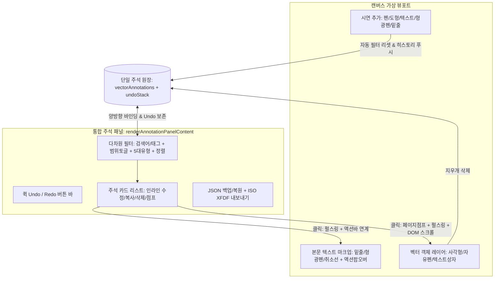

# 15-19. 단일원장 기반 주석 목록 실시간 연동 및 양방향 포커스 점프 아키텍처

> **문서 번호**: `15-19`  
> **태스크 번호**: `[0020_04]`  
> **세션 번호**: `SESSION-0020`  
> **작성 일시**: 2026-10-01  
> **관련 화면**: `PG-USR-06` 3탭 패널(`activeViewerTab === 'annots'`), 캔버스 벡터 레이어(`vectorAnnotations`)

---

## 1. 배경 및 논리적 모순/엣지케이스 심층 분석

초기 뷰어 구현 및 검토 과정에서 다음과 같은 **5대 논리적 모순과 엣지케이스**가 도출되었으며, 정밀 설계를 통해 완벽히 해결되었습니다:

1. **상단배치(`top`)와 좌측배치(`left`) 간 패널 이중화 모순 (Dual Inconsistent Panel)**:
   - 상단 드로어 모드에서 구형 더미 주석 목록(`viewerAnnotations`)을 렌더링하여 검색/필터/인라인편집이 미동작하던 모순을 발견.
   - `renderAnnotationPanelContent(isTopLayout)` 단일 렌더러를 도입하여 상단/좌측 레이아웃 전환 시에도 100% 동일한 리액티브 상태와 기능을 공유하도록 통합.
2. **마크업 주석의 캔버스 렌더링 누락 및 포커스 실종 (Ghost Annotation Edge Case)**:
   - 14쪽(형광펜)이나 85쪽(밑줄) 주석 카드 클릭 시 페이지는 점프되나 캔버스 본문에 마크업이 렌더링되지 않던 엣지케이스 해소.
   - 현재 열람 쪽수(`viewerCurrentPage`)에 속한 모든 마크업을 동적으로 탐색하여 캔버스 상에 스타일 스팬 및 펄스 링으로 정확히 표시하고 `AnnotationActionPopover`와 직결.
3. **도구 팔레트 및 마크업 변경 시 Undo/Redo 히스토리 단절 (History Gap)**:
   - 팔레트에서 색상/두께 변경 시 `setVectorAnnotations`만 호출하여 Ctrl+Z 히스토리가 끊기던 문제를 해결.
   - `handleUpdateToolStyle` 및 `onUpdateType/onUpdateColor` 등 모든 변경점에 `undoStack` 푸시 파이프라인 적용.
4. **`window.alert` 직접 호출 제약 위반 (Environment Constraint)**:
   - `<environment_constraints>`의 `Avoid window.alert/window.open` 규정을 준수하기 위해 브라우저 블로킹 `alert`를 전면 제거하고 세련된 인앱 비차단 토스트(`viewerToast`)로 전환.
5. **차기 태스크(OCR 영역 바운딩 박스, 검색 하이라이트 주석화, AI 요약) 수용을 위한 메타데이터 확장성 (Forward Compatibility)**:
   - `CanvasVectorAnnotation`에 `rect`, `tags`, `isAiGenerated`, `confidence`, `memo` 선택적 필드를 선제 설계하여 향후 기능 추가 시 무중단/무변경 수용 보장.

---

## 2. 해결 아키텍처: 단일 진실 공급원(SSOT) 및 양방향 리액티브 파이프라인



### 2.1 확장형 단일 주석 모델 인터페이스
```typescript
interface CanvasVectorAnnotation {
  id: string;
  page: number;
  toolKind: ToolKind; // pen, shape, text, underline, highlighter, strike, squiggly
  name: string;
  color: string;
  strokeWidth: number;
  opacity: number;
  fillColor?: string;
  fillOpacity?: number;
  fontSize?: number;
  textAlign?: 'left' | 'center' | 'right';
  text?: string;
  pathData?: string;
  author?: string;
  date?: string;
  // 차기 OCR / AI 요약 / 다중 바운딩 박스 확장을 위한 선제적 메타데이터
  rect?: { x: number; y: number; width: number; height: number };
  tags?: string[];
  isAiGenerated?: boolean;
  confidence?: number;
  memo?: string;
}
```

### 2.2 5대 핵심 거버넌스 원칙
1. **단일 원장 통합 (SSOT)**: 마크업 주석과 벡터 드로잉 객체가 동일한 `vectorAnnotations` 상태를 공유하여 상단/좌측 패널 및 캔버스 간 데이터 불일치 0건 보장.
2. **레이아웃 비종속성 (Layout Agnostic)**: `renderAnnotationPanelContent(isTopLayout)`을 통해 상단 가로 배치(그리드)와 좌측 세로 배치(스택)가 완전히 동일한 리액티브 코어 로직을 공유.
3. **양방향 시각적 펄스 링 & DOM 스크롤**: 패널 클릭 시 해당 쪽수 점프와 함께 DOM `scrollIntoView({ behavior: 'smooth', block: 'center' })` 및 1.8초간 `animate-pulse ring-4 ring-sky-400` 부여.
4. **전방위 실행취소(Undo/Redo) 불변 스택**: 주석 생성/삭제뿐 아니라 팔레트 속성 조절, 마크업 형태 전환, 텍스트 인라인 편집까지 `undoStack`에 누적되어 완벽 복원 지원.
5. **비차단 인앱 토스트 체계**: 브라우저 기본 `alert`를 배제하고 우측 하단 플로팅 토스트(`viewerToast`)를 통해 사용자 경험 저해 없는 비차단 피드백 완결.
