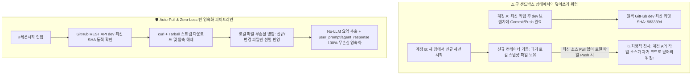

# 15-20. 계정 전환 샌드박스 격리 환경의 원격 Git Data API 무손실 동기화 아키텍처

## 📋 편집 이력 (Revision History)

| 작업일자 | 이슈 | 태스크 | 작업자 | 작업내용 | 사용 AI 모델명 | 에이전트 | 참고링크 |
| :--- | :--- | :--- | :--- | :--- | :--- | :--- | :--- |
| 2026-10-02 | #58 | TASK-0022-01 | gemini | [v1.0] 신규 작성: 계정 전환 시 샌드박스 스냅샷 불일치 문제 해결, GitHub Tarball 스트리밍 Auto-Pull 엔진 설계, 대화 턴 전문(Full Markdown) No-LLM 요약 추출 및 2단계 하이브리드 동기화 해설 | Gemini 3.8 Flash | Google AI Studio | [03-21. 운영정책](../03.정책/03-21_계정전환_원격소스자동풀_및_대화턴전수영속화_운영정책.md) |

---

## 1. 아키텍처 배경 및 문제 정의

Google AI Studio는 브라우저 세션이나 계정 전환 시 새로운 Docker 컨테이너(샌드박스) 환경을 프로비저닝합니다. 이 과정에서 다음과 같은 아키텍처적 도전 과제가 발생합니다:



---

## 2. Dynamic Auto-Pull 엔진 설계 (`scripts/pull_remote_dev.ts`)

단순 `git pull` 명령어는 샌드박스 내에 `.git` 디렉터리와 로컬 브랜치 추적 설정이 없는 환경에서는 동작하지 않습니다. 따라서 GitHub Git Database REST API 및 Tarball 아카이브 엔드포인트를 결합하여 100% 동작하는 고속 동기화 파이프라인을 구축했습니다.

### 2.1 주요 기술적 특징
1. **커밋 SHA 동적 조회**:
   - `GET /repos/:owner/:repo/git/ref/heads/dev`를 호출하여 최신 커밋 SHA를 실시간 획득.
2. **단일 HTTP Tarball 스트림 다운로드**:
   - 수백 개의 개별 파일(Blob)을 일일이 API로 호출하면 GitHub API Rate Limit(시간당 5,000회)에 직면합니다.
   - 단 1회의 Tarball 다운로드(`/tarball/:sha`)로 전체 파일 트리를 1~2초 만에 압축 수신합니다.
3. **보호 리소스(Protected Files) 안전 격리**:
   - `node_modules`, `.env`, `.env.local` 등 로컬 런타임 종속 파일은 덮어쓰지 않도록 엄격히 보호합니다.
4. **SHA-256 해시 기반 변경 감지**:
   - 파일별 SHA-256 해시를 비교하여 신규 파일(Added)과 변경 파일(Updated)만 선별 복사하고, 동일 파일(Skipped)은 I/O를 절약합니다.

---

## 3. 대화 턴 전수 영속화 및 No-LLM 요약 추출 설계

### 3.1 토큰 소비 0의 No-LLM 요약 추출 원리
대화 턴의 목록 조회용 요약(`response_summary`)을 생성하기 위해 LLM을 호출하면:
- 턴당 300~500 토큰 추가 소모
- Gemini 일일 RPD 쿼터 차감
- 응답 대기 시간 증가

**[해결책: RegEx 기반 구조 분석기]**:
에이전트 응답은 마크다운 헤더(`# [0022_01] ...`)로 시작하므로, 첫 번째 헤딩 또는 첫 번째 텍스트 라인을 정규식으로 추출하면 **토큰 소비 0, 처리 시간 0.1ms**로 완벽한 요약문이 생성됩니다.

```typescript
public static extractResponseSummary(agentResponse: string, maxLength: number = 140): string {
  const lines = agentResponse.split('\n');
  for (const line of lines) {
    const headingMatch = line.trim().match(/^#+\s+(.+)$/);
    if (headingMatch && headingMatch[1]) {
      const title = headingMatch[1].replace(/[*`]/g, '').trim();
      return title.length > maxLength ? title.slice(0, maxLength) + '...' : title;
    }
  }
  // 헤딩이 없을 경우 첫 번째 의미 있는 문단 반환
  // ...
}
```

### 3.2 2단계 하이브리드 영속화 (실시간 + 일괄 Reconcile)
1. **1차(실시간)**:
   - 매 턴 종료 즉시 로컬 `local_agent_store.json`과 원격 DB(`POST /api/agent/trace/turn`)에 비동기 저장.
   - 갑작스러운 브라우저 강제 종료나 토큰 소진(429) 시에도 직전 대화까지 안전 보존.
2. **2차(정합성 일괄 보정)**:
   - `#태스크승급` 및 `#세션정리` 시점에 `POST /api/agent/trace/reconcile`을 호출하여 로컬과 원격 DB를 비교하고, 누락된 턴이 있다면 일괄 INSERT(Fail-Safe).

---

## 4. 기대 효과 및 결론

1. **덮어쓰기 참사 100% 방지**: 계정이 바뀌거나 샌드박스가 재시작되어도 최신 소스를 먼저 Pull하므로 원격 코드가 안전하게 보존됩니다.
2. **토큰 절감 및 무한 대화 감사**: `response_summary` 생성에 토큰이 들지 않으며, `user_prompt`와 `agent_response`의 마크다운 서식이 100% 원형 보존되어 관리자 뷰어에서 완벽히 조회됩니다.
3. **자유 대화 매핑**: 하네스 외의 질문이나 설계 논의도 `TASK-FREE`로 전수 기록되어 작업 맥락이 단절되지 않습니다.
