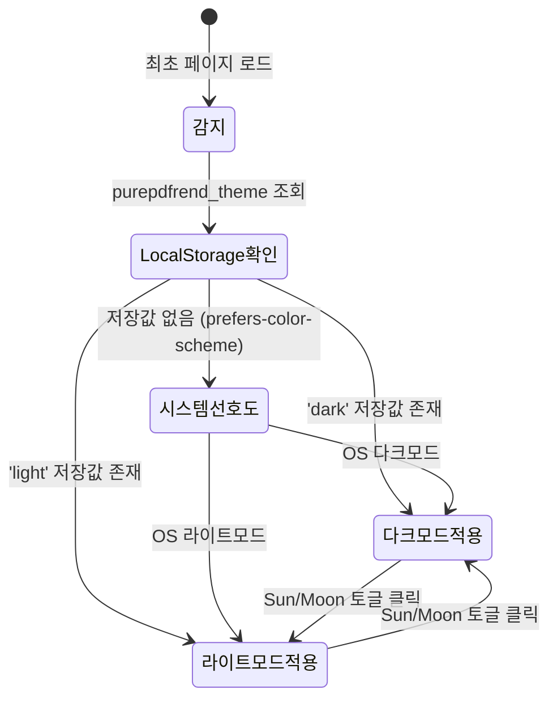

# 글로벌 헤더 테마 스위처 및 관리자 실제 REST API 1단계 연동 패턴 해설

> **문서 ID**: `DOC-15-23-THEME-ADMIN-API`  
> **버전**: `v1.0.0`  
> **작성일자**: `2026-10-08`  
> **적용 표준**: `AGENTS.md v2.2`, `GEMINI.md v1.0.0`

---

## 1. 개요 및 배경

본 문서는 purePDFrend 상단 글로벌 네비게이션 헤더(`Navbar`)에 원클릭 Sun/Moon 테마 스위처를 구축하고, 관리자 시스템서비스 1단계(PG-ADM-01 보안 IP 관리, PG-ADM-03 사용자 계정 관리)를 Mock 상태에서 실제 백엔드 Express REST API 및 PostgreSQL/로컬 스토어 듀얼 영속화 파이프라인으로 전환한 아키텍처 패턴을 해설합니다.

---

## 2. 테마 스위치 아키텍처 패턴

### 2.1 CSS & DOM 상태 머신

1. **지연 없는 원클릭 동기화**:
   - `document.documentElement.classList.toggle('dark', isDarkMode)`
   - `document.documentElement.classList.toggle('light', !isDarkMode)`
   - 로컬 스토리지(`purepdfrend_theme`)와 즉시 동기화되어 새로고침 시에도 사용자 테마가 유지됩니다.
2. **모바일 반응형 드로어 44px 가드레일**:
   - 데스크톱 슬림 헤더뿐 아니라 모바일 햄버거 드로어 푸터에도 44px 터치 높이의 테마 스위치 바가 배치되어 모바일 사용자 편의성을 극대화했습니다.

---

## 3. 관리자 REST API 듀얼 영속화 패턴

### 3.1 PG-ADM-01 보안 IP 관리 파이프라인
- `GET /api/admin/security/ips`: 화이트리스트 CIDR 대역 및 긴급 차단 블랙리스트 목록 반환.
- `POST /api/admin/security/ips`: 유효성 검증을 거친 IP/CIDR 등록 및 실시간 캐시 갱신.
- `DELETE /api/admin/security/ips`: 화이트/블랙리스트 특정 엔트리 삭제.
- `POST /api/admin/security/config`: 2단계 인증 강제화, 해외 IP 차단(Geo-Blocking), 오프라인 토큰 유효기간 정책 업데이트.

### 3.2 PG-ADM-03 사용자 계정 관리 파이프라인
- `GET /api/admin/users`: PostgreSQL `aiagent.agent_user_account` 연계 및 로컬 인메모리 관리자 시드 데이터와 병합 조회.
- `POST /api/admin/users`: 관리자 직접 신규 사용자 계정 등록.
- `PATCH /api/admin/users/:id`: 다중 권한(`roles`), 계정 상태(`정상`, `제한`, `휴면`), 오프라인 사용 권한 동적 수정.
- `DELETE /api/admin/users/:id`: 사용자 계정 삭제.

---

## 4. TDD 및 무결성 검증 결론

1. `tests/admin_api_and_theme.test.ts` 5대 단위 테스트 100% 통과 (실행 시간 273ms).
2. `tsc --noEmit` 정적 타입 린트 및 `compile_applet` 번들 빌드 성공.
3. 모바일 Break-to-Card 뷰에서 가로 스크롤 없이 44px 터치 타깃 완벽 보장.
