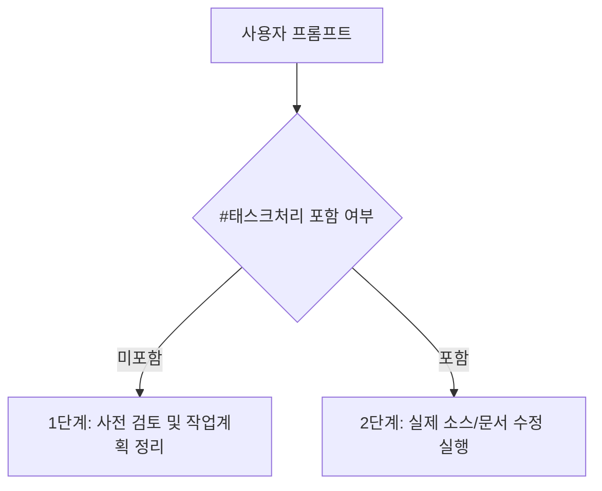

# 15. 학습 (Knowledge & Prompt Engineering) 요약 가이드

## 📋 폴더 개요
에이전트 프롬프트 엔지니어링 패턴, LLM 토큰 최적화 기법, 도메인 지식 정리본을 보관합니다.

## 📑 하위 문서 목록
| 문서번호 | 파일명 | 문서 제목 | 주요 내용 요약 |
| :--- | :--- | :--- | :--- |
| `15-01` | `15-01_에이전트_프롬프트_표준_패턴.md` | 에이전트 프롬프트 표준 패턴 | #태스크처리 키워드 기반 안전 실행 및 사전 질문 정리 패턴 |

