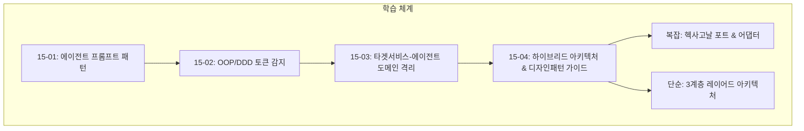

# 15. 학습 (Knowledge & Prompt Engineering) 요약 가이드

## 📋 폴더 개요
에이전트 프롬프트 엔지니어링 패턴, LLM 토큰 최적화 기법, 도메인 지식 정리본을 보관합니다.

## 📑 하위 문서 목록
| 문서번호 | 파일명 | 문서 제목 | 주요 내용 요약 |
| :--- | :--- | :--- | :--- |
| `15-01` | `15-01_에이전트_프롬프트_표준_패턴.md` | 에이전트 프롬프트 표준 패턴 | #태스크처리 키워드 기반 안전 실행 및 사전 질문 정리 패턴 |
| `15-02` | `15-02_OOP_도메인기반_토큰한도_감지설계_학습가이드.md` | OOP & DDD 토큰 감지 설계 가이드 | 전략 패턴, 레지스트리 팩토리, SOLID 원칙 기반 확장성 높은 설계 및 실전 샘플 코드 |
| `15-03` | `15-03_타겟서비스_에이전트_도메인격리_아키텍처_비교_및_선정.md` | 타겟서비스-에이전트 도메인격리 아키텍처 | 5대 격리 대안 비교, 헥사고날 포트/어댑터 채택 이유, AIDD 컨텍스트 오염 방지 전략 |
| `15-04` | `15-04_초급개발자를_위한_하이브리드_아키텍처_전환가이드_및_디자인패턴_교육자료.md` | 초급개발자 하이브리드 아키텍처 및 디자인패턴 가이드 | 복잡(헥사고날)+단순(레이어드) 이원화 전환 가이드, 4대 실전 디자인 패턴(전략, 파사드, 어댑터, 싱글톤) 및 체크리스트 |
| `15-05` | `15-05_초기구현_대비_OOP_도메인주도설계_리팩토링_및_디자인패턴_교육자료.md` | 초기구현 대비 OOP/DDD 리팩토링 및 디자인패턴 교육가이드 | 거대 정적 클래스 안티패턴 해소, 5대 패턴(전략, VO, 빌더, 서비스, 파사드) 비교 및 장단점 매트릭스 |
| `15-06` | `15-06_PDF_메타데이터_도메인모델링_및_유니코드_인코딩_아키텍처_학습가이드.md` | PDF 메타데이터 도메인 모델링 및 유니코드 인코딩 아키텍처 학습 가이드 | ISO 32000-1 InfoDict, UTF-16BE 무손실 인코딩, 서지/활동/독서 3대 도메인 VO 및 헥사고날 포트 가이드 |
| `15-07` | `15-07_PDF_보안전략패턴_및_상황별_암호화_디자인패턴_학습가이드.md` | PDF 보안 전략 패턴 및 상황별 암호화 디자인 패턴 학습 가이드 | 전략/팩토리/빌더/파사드 4대 디자인 패턴, ISO 32000-1 권한 비트마스크 연산 및 메타데이터 보안 연계 |
| `15-08` | `15-08_프론트엔드_모달_도메인파이프라인_연계_및_원격브랜치_실시간_크로스체크_학습가이드.md` | 프론트엔드 모달-도메인 파이프라인 연계 및 원격 브랜치 실시간 크로스체크 학습 가이드 | 파이프라인 패턴, WinAnsi 폰트 예외 방어 가드레일, 원격 3대 브랜치 실시간 크로스체크 API 및 Fast-Forward 승급 규약 |

