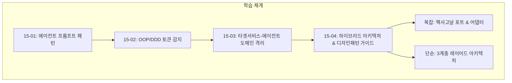

# 15. 학습 (Knowledge & Prompt Engineering) 요약 가이드

## 📋 폴더 개요
에이전트 프롬프트 엔지니어링 패턴, LLM 토큰 최적화 기법, 도메인 지식 정리본을 보관합니다.

## 📑 하위 문서 목록
| 문서번호 | 파일명 | 문서 제목 | 주요 내용 요약 |
| :--- | :--- | :--- | :--- |
| `15-01` | `15-01_에이전트_프롬프트_표준_패턴.md` | 에이전트 프롬프트 표준 패턴 | #태스크처리 키워드 기반 안전 실행 및 사전 질문 정리 패턴 |
| `15-02` | `15-02_OOP_도메인기반_토큰한도_감지설계_학습가이드.md` | OOP & DDD 토큰 감지 설계 가이드 | 전략 패턴, 레지스트리 팩토리, SOLID 원칙 기반 확장성 높은 설계 및 실전 샘플 코드 |
| `15-03` | `15-03_타겟서비스_에이전트_도메인격리_아키텍처_비교_및_선정.md` | 타겟서비스-에이전트 도메인격리 아키텍처 | 5대 격리 대안 비교, 헥사고날 포트/어댑터 채택 이유, AIDD 컨텍스트 오염 방지 전략 |
| `15-04` | `15-04_초급개발자를_위한_하이브리드_아키텍처_전환가이드_및_디자인패턴_교육자료.md` | 초급개발자 하이브리드 아키텍처 및 디자인패턴 가이드 | 복잡(헥사고날)+단순(레이어드) 이원화 전환 가이드, 4대 실전 디자인 패턴(전략, 파사드, 어댑터, 싱글톤) 및 체크리스트 |
| `15-14` | `15-14_사용자_홈대시보드_헤더간소화_및_7대PDF도구_인라인작업화면_전환아키텍처.md` | 사용자 홈 대시보드 헤더 간소화 및 7대 PDF 도구 인라인 작업 스튜디오 아키텍처 | 상단 탑레이어 단일 모듈화, 프로필 레이어 정밀 구조화, 7대 PDF 도구 인라인 작업화면 전환 및 Focus Mode 반영 |
| `15-16` | `15-16_GitHub_연계서비스_아이디어_및_멀티클라우드_리소스스토리지_거버넌스_백로그_설계.md` | GitHub 연계 서비스 아이디어 및 멀티 클라우드 리소스 스토리지 백로그 설계 | GitOps 기반 7대 서비스 아이디어, 문서카드 총/열람페이지, 멀티 클라우드 UI, 퀵설정 롱프레스 지글 위치설정, 인메모리/IndexedDB 캐싱 백로그 |
| `15-17` | `15-17_PG_USR_06_고성능_가상뷰어_연동_및_반응형_3탭레이아웃_전환_아키텍처.md` | PG-USR-06 가상 뷰어 연동 및 3탭 상단/좌측 배치 전환 아키텍처 | 서재-뷰어 간 실시간 읽은 쪽수/진척도 양방향 동기화, 3탭 상단/좌측 배치 전환, 독서 집중(Zen) 모드 및 도구속성바 인라인 설계 |
| `15-18` | `15-18_Xodo_벤치마킹_다형성_도구속성_팔레트_및_벡터주석_양방향_바인딩_패턴.md` | Xodo 벤치마킹 다형성 도구속성 팔레트 및 벡터주석 양방향 바인딩 패턴 해설 | 도구별(펜/지우개/도형/텍스트) 다형성 속성 렌더러 분기, 투명/24색 채우기 옵션, 캔버스-팔레트 간 Two-way Reactive Binding |
| `15-19` | `15-19_단일원장_기반_주석목록_실시간연동_및_양방향_포커스점프_아키텍처.md` | 단일원장 기반 주석목록 실시간 연동 및 양방향 포커스 점프 아키텍처 | 텍스트 마크업과 벡터 객체 단일 원장(SSOT) 통합, 4중 복합 필터(검색/범위/유형/정렬), 고아 상태 방어 및 펄스 링 포커스 |
| `15-20` | `15-20_계정전환_샌드박스격리_원격GitDataAPI_무손실동기화_아키텍처.md` | 계정 전환 샌드박스 격리 원격 Git Data API 무손실 동기화 아키텍처 | 멀티계정 샌드박스 스냅샷 불일치 해소, Tarball 스트리밍 Auto-Pull 엔진, 대화턴 전문 No-LLM 요약 추출 및 2단계 하이브리드 등록 해설 |

```mermaid
graph TD
    subgraph 학습 체계
        L1[15-01: 에이전트 프롬프트 패턴] --> L2[15-02: OOP/DDD 토큰 감지]
        L2 --> L3[15-03: 타겟서비스-에이전트 도메인 격리]
        L3 --> L4[15-04: 하이브리드 아키텍처 & 디자인패턴 가이드]
        L4 --> Hexagonal[복잡: 헥사고날 포트 & 어댑터]
        L4 --> Layered[단순: 3계층 레이어드 아키텍처]
    end
```
