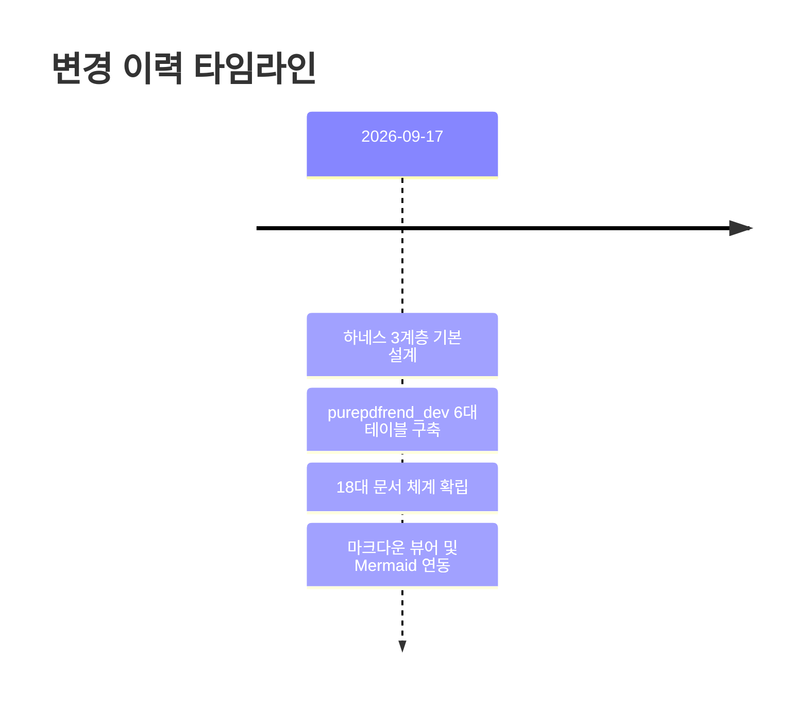

# 16. 로그 (Changelog & Audit Traces) 요약 가이드

## 📋 폴더 개요
버전별 변경 이력(Changelog), 주요 배포 로그, 대화 턴 추적 및 감사 요약 보고서를 관리합니다.

## 📑 하위 문서 목록
| 문서번호 | 파일명 | 문서 제목 | 주요 내용 요약 |
| :--- | :--- | :--- | :--- |
| `16-01` | `16-01_시스템_변경로그_v1.0.md` | 시스템 변경로그 v1.0 | 18대 문서 체계 도입, 작업그래프 뷰모드, 감사 DB 실시간 연동 이력 |

