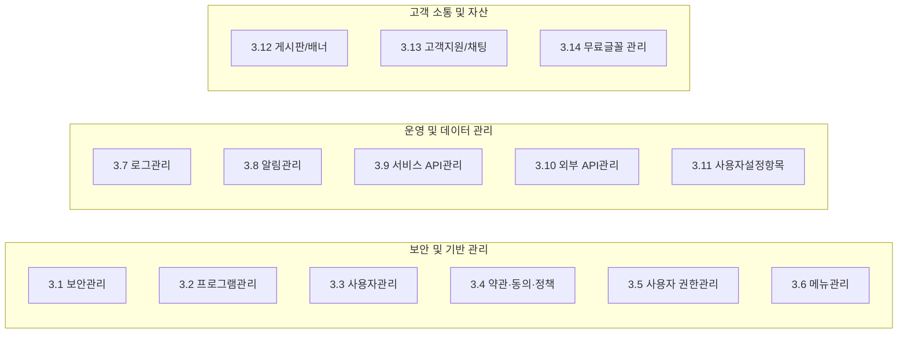
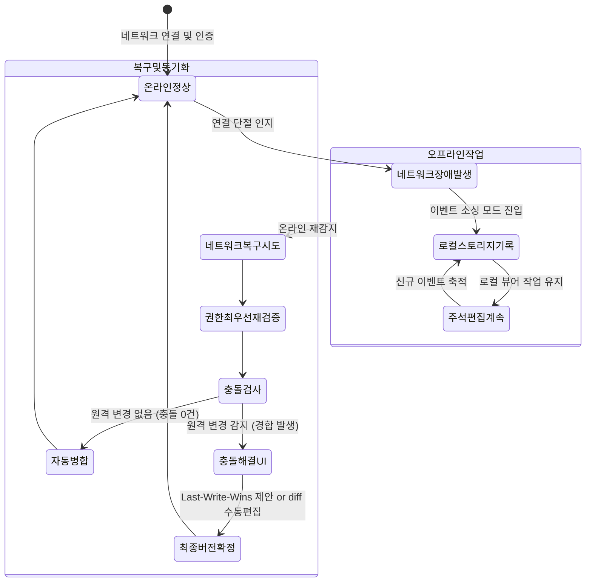

# purePDFrend 서비스 목적·페르소나 및 핵심 시나리오 기획서 (초안)

> **문서 식별자**: `DOC-REF-260927-01`  
> **최초 작성일**: 2026-09-27  
> **상태**: 기획 초안 (Draft)  
> **적용 범위**: purePDFrend 3대 도메인 (에이전트 / 관리자 / 사용자) 전반

---

## 1. 서비스 기본 철학 및 운영 환경

### 1.1 서비스 성격 및 오프라인 우선(Local-First) 원칙
- **웹 기반 하이브리드 서비스**: 온라인 네트워크 기반으로 작동하되, 네트워크 단절(오프라인) 상태에서도 핵심 기능(문서 뷰어, 로컬 파일 주석 편집, 북마크 관리 등)을 독립적으로 정상 사용할 수 있어야 한다.
- **권한 기반 실행 통제**: 오프라인 상태라도 무제한 기능이 허용되는 것이 아니며, **직전 온라인 상태에서 최종 검증·캐싱된 사용자 권한(Permission Snapshot)**을 기반으로 엄격히 통제된다.
  - **오프라인 시**: 기 로그인 세션 스토리지 및 로컬 암호화 캐시를 기반으로 인가된 범위 내 로컬 작업만 처리.
  - **온라인 재진입 시**: 서버 권한 정책 및 토큰을 즉시 최우선 현행화(Re-validation).

---

## 2. 3대 서비스 도메인 체계 및 접근 제어

```mermaid
graph TD
    User([사용자 접속]) --> RoleCheck{로그인 및 권한 판정}
    
    RoleCheck -->|일반 인가 사용자| USR[3. 사용자 서비스 (User Portal)]
    RoleCheck -->|관리자 권한 보유| ADM[2. 관리자 서비스 (Admin Portal)]
    RoleCheck -->|시스템관리자 (.env 계정)| AGT[1. 에이전트 서비스 (Agent Governance)]

    USR --> P1[첫화면 / 홈 / 마이페이지 / 문서관리 / 뷰어 / 공유 / 설정]
    ADM --> P2[보안 / 프로그램 / 권한 / 약관 / 메뉴 / 로그 / 알림 / 게시판]
    AGT --> P3[거버넌스 하네스 / 세션추적 / 무결성감사 / 쿼터관제]
```

### 2.1 도메인 분류 및 인입 조건
1. **에이전트 서비스 (Agent Service)**:
   - AI 에이전트 하네스, 대화 턴 추적, 무결성 감사, 세션 및 쿼터 관리 전용 콘솔.
   - 프로젝트 환경설정(`.env`)의 `SYSTEM_ADMIN_EMAILS`에 명시된 최고 관리자 계정 로그인 시에만 상단에 진입 버튼/아이콘 활성화.
2. **관리자 서비스 (Admin Service)**:
   - 플랫폼 운영, 14대 관리 기능, 사용자 권한 및 프로그램 구성을 제어하는 백오피스.
   - 데이터베이스 상 관리자 권한(`ROLE_ADMIN` 등)이 부여된 계정 로그인 시 이동 버튼 활성화.
3. **사용자 서비스 (User Service)**:
   - 일반 회원 및 비회원이 이용하는 PDF 제작, OCR 교정, 뷰어 및 주석 스튜디오.

---

## 3. 관리자 서비스 (14대 관리 기능 상세)

관리자 서비스는 사용자 서비스를 유연하고 안전하게 운영하기 위한 14대 독립 관리 모듈로 구성된다.



### 3.1 보안관리 (Security Governance)
- **아이피 접근제어**: 국가별/해외 IP 차단 여부 토글, 허용 IP 화이트리스트 및 블랙리스트 관리.
- **접근제어 관리 (2단계 인증)**: 2FA(Two-Factor Authentication) 강제 적용 정책 관리 (기본 ID/PW + 소셜인증/이메일 OTP 인증).
- **소셜 인증 관리**: 카카오톡, 네이버, 구글 등 Provider별 Client ID, Secret, Auth URL, Callback URL 및 수집 속성 관리.
- **세션 타임아웃 관리**: 유휴 세션 시간(Idle Timeout), 절대 만료 시간(Absolute Expiry), 동시 로그인 세션 수 제한.
- **추가 보안 설정**: 비밀번호 실패 횟수 제한(Account Lockout), 비정상 패턴 탐지 알림.

### 3.2 프로그램 관리 (Modular Program Hierarchy)
- **프로그램 단위 등록**: 플랫폼 내 모든 화면과 하위 뷰는 독립된 '프로그램(Program ID)'으로 등록·관리.
- **부모-자식 계층 구조**: 하나의 프로그램이 다수의 하위 프로그램을 거느리는 부모 프로그램이 될 수 있음 (탭 화면, 하위 마이크로 뷰 조합).
- **버전별 화면 구성 및 교체**: 동일 프로그램에 대해 버전별 UI를 구성하고, 런타임에 다른 버전이나 다른 프로그램으로 동적 교체(A/B 테스트 및 핫스왑) 가능.

### 3.3 사용자 관리 (User Directory)
- **사용자 속성 제어**: 회원 상태(정상, 정지, 탈퇴), 비밀번호 강제 초기화, 접근 제한, 권한 그룹 배정, **오프라인 사용 허용 여부** 속성 관리.
- **개인정보 임의 변경 불가 원칙**: 관리자라도 사용자의 개인정보(프로필 사진, 닉네임, 실명, 연락처, 소셜 연동 정보, 이메일 등)를 임의로 직접 수정할 수 없음(무결성 보호).
- **사용자 개인화 설정 조회**: 테마, 페이지 넘김 모드(가로/세로/한쪽), 뷰어 기본값 등 사용자가 지정한 환경설정 값 조회.
- **외부 스토리지 관리**: 사용자별 연동 가능한 클라우드/로컬 스토리지 엔드포인트 관리 (Google Drive, NAS/QNAP, FTP/SFTP).

### 3.4 약관·동의·정책 (Terms & Policy Engine)
- **웹 문서 기반 컨텐츠 관리**: 화면에 노출되는 법적 고지 및 동의 항목을 동적으로 관리.
  - 관리 대상: 이용약관, 개인정보 수집·이용 동의, 마케팅 수신동의, 저작권 안내, 면책조항, 쿠키 정책, 청소년 보호정책, 고객지원 정책.
- **문서그룹 ID 및 버전 관리**: 문서그룹 ID(`DOC_GROUP_ID`)를 기반으로 현재 효력이 있는 최종 개정판을 서비스 화면에 자동 표시.
- **동의 이력 추적**: 사용자가 동의한 시점의 `문서그룹ID` 및 `개정버전번호`를 원장에 정확히 기록하여 법적 증빙 확보.

### 3.5 사용자 권한관리 (RBAC & Individual Overrides)
- **권한 그룹 관리**: '권한 그룹(Role Group)'을 정의하고, 각 그룹에 프로그램별 실행/읽기/쓰기 권한을 매핑.
- **우선순위 기반 다중 그룹 부여**: 한 사용자에게 복수의 권한 그룹을 부여할 수 있으며, 그룹 간 우선순위(Priority Level)를 통해 권한 충돌 해소.
- **개별 프로그램 권한 우선 원칙**: 특정 사용자에게 부여된 **개별 프로그램 권한은 권한 그룹 정책보다 항상 최우선** 적용.
- **동의 정보 조회 연동**: 특정 권한 부여 시 필수 동의 항목(약관, 개인정보 등) 완료 여부와 교차 검증.

### 3.6 메뉴관리 (Dynamic Navigation)
- **프로그램 ID 기반 메뉴 트리**: 등록된 프로그램 ID를 매핑하여 서비스 메뉴 구조 및 순서(Sort Order) 구성.
- **도메인 분리 관리**: 관리자 서비스 메뉴와 사용자 서비스 메뉴를 엄격히 분리하여 관리.
- **노출/숨김 토글**: 미사용 또는 점검 중인 프로그램 메뉴 숨김 처리.

### 3.7 로그관리 (Audit Trail)
- **사용자 행동 이력 추적**: 로그인, 파일 다운로드, 주석 편집, 공유, 권한 변경 등 모든 활동 로그 조회.
- **다차원 검색 필터**: 사용자 식별자, IP 주소, 행동 유형, 작업 일시(범위), 프로그램 ID별 검색.

### 3.8 알림관리 (Multi-Channel Notification)
- **채널 유형**: 이메일, 모바일 푸시(Push), 인앱 알림(In-App Notification).
- **노출 방식 설정**: 이메일 발송, 상단 알림 바, 공지 게시판 연동, 화면 진입 팝업 모달.
- **발송 제어**: 즉시 등록, 수정, 삭제, 예약 발송, 발송 대상 타겟팅(전체, 특정 권한그룹, 개별 사용자).
- **긴급도 및 수신 추적**: 긴급 공지 / 일반 공지 구분, 개별 수신확인(Read Receipt) 여부, 발송 및 수신 이력 상세 통계.

### 3.9 서비스 API 관리 (Internal PDF Core API)
- 백엔드에서 자체 제공하는 순수 PDF 조작, OCR, 가상 뷰어, 보안 암호화 API 엔드포인트 명세 및 모니터링.

### 3.10 외부 API 관리 (3rd Party Integrations)
- 소셜 로그인 OAuth Provider, 외부 번역 API, 외부 클라우드 드라이브 연동 URL 및 API 키 상태 관리.

### 3.11 사용자 설정 항목 관리 (User Preference Metadata)
- 사용자에게 제공할 설정 옵션 자체를 관리자가 메타데이터로 등록/수정/삭제.
- 속성: 설정명, 상세 설명, 입력 유형(`체크(ON/OFF)`, `선택(드롭다운/목록)`), 서비스 적용 여부.

### 3.12 게시판 및 배너 관리 (Content Board)
- **공지사항 관리**: 일반 공지, 긴급 공지, 이벤트 공지별 노출 방식(이메일, 알림, 게시판, 팝업), 예약 및 노출 위치(첫화면, 홈화면) 제어.
- **배너 관리**:
  - 등록 모드: HTML 직접 입력, 텍스트, 이미지 파일, 링크 URL.
  - 공개 일정(시작/종료일시), 노출 위치(첫화면 롤링, 홈화면 상단 등), 사용 여부.
  - 노출 및 클릭 분석 데이터 집계 (사용자, 시간대, 위치).

### 3.13 고객관리 (Support & Helpdesk)
- **운영시간 안내**: 고객센터 운영 요일, 시간, 점심시간 정보 관리.
- **1:1 상담 예약**: 비동기 문의 및 유선/화상 상담 예약 신청 접수 및 상태 관리.
- **사용자 리뷰/후기 관리**: 사용자가 남긴 서비스 평점 및 후기 검토, 승인, 노출 관리.
- **실시간 고객지원 채팅**: 관리자와 사용자 간 실시간 채팅 인터페이스 (화면 캡처 이미지, PDF 파일 첨부 공유 지원).
- **단계별 이용 가이드 관리**: 화면별 단계형 튜토리얼(Step-by-step Guide) 및 도움말 콘텐츠 등록.

### 3.14 무료 글꼴 관리 (Font Repository)
- 텍스트 주석 및 전자책 서식용 무료 글꼴(OF/TTF/WOFF2) 등록, 별명(Alias) 지정, 삭제 관리.

### 3.15 단축키 및 도구아이콘 관리 (Shortcuts & Tool Icon Resource Governance)
- **도구별 아이콘 디자인 리소스 지정**: 도구별로 사전 디자인된 복수의 아이콘 리소스(`res_pen_pencil`, `res_pen_nib`, `res_highlight_marker`, `res_rect_solid` 등)를 리소스 딕셔너리로 관리하고, 관리자가 도구별로 원하는 리소스 이름을 지정하여 문서뷰어 UI에 표시되도록 통합 제어.
- **기본 단축키 정책 관리**: 사용자 서비스 문서뷰어 기능에 적용할 PC/태블릿 키보드 단축키 기본값을 정의하고 충돌 여부를 사전 검증.
- **시스템 표준값 배포**: 도구별 아이콘 리소스 및 단축키(`P`, `Shift+H`, `Ctrl+U`, `R`, `K` 등) 매핑 테이블 관리 및 `data/default_viewer_shortcuts_tools.json` 배포.

### 3.16 도구그룹 관리 (Tool Group Governance)
- **8대 뷰어 모드별 기본 도구 편성**: 보기, 주석달기, 그리기, 작성및서명, 변환, 양식준비, 삽입, 즐겨찾기 그룹의 기본 도구 구성 정의.
- **그룹 간 중복 허용 정책**: 그리기에 있는 도구(예: 직사각형)를 주석달기 등 타 그룹에 중복 편성할 수 있도록 허용하는 전역 정책 관리.
- **도구그룹 기본값 배포 및 초기화 기준점 제공**.

---

## 4. 사용자 서비스 (9대 핵심 화면 및 세부 시나리오)

### 4.1 첫 화면 (Landing & Public Viewer)
- **상단 글로벌 액션**:
  - `[로그인 / 회원가입]` 버튼 ➔ 인증 화면으로 이동.
  - `[읽기모드 문서뷰어]` 버튼 ➔ 비회원/공개 문서 열람 모드로 즉시 진입.
- **문서 조회 바 (상단)**:
  - 문서 ID 또는 공유 URL 링크를 직접 입력하여 열람 대상 문서 즉시 검색.
  - 조회 결과: 문서 썸네일, 제목, 페이지 수 표시 ➔ 썸네일 클릭 시 읽기 전용 뷰어 로드.
- **중앙 롤링 배너**: 관리자 배너 시스템에서 등록된 이벤트 및 안내 배너 슬라이드.
- **하단 3대 탭**: `[공지사항]` / `[사용자 리뷰]` / `[단계별 이용 가이드]` 탭 전환 UI.
- **바닥글 (Footer)**: 고객센터 운영시간 및 법적 고지.

### 4.2 로그인 / 회원가입 화면 (Authentication)
- **로그인**:
  - 기본 ID/비밀번호 인증.
  - 시스템 정책에 따라 등록된 소셜 계정 간편인증 또는 이메일 OTP 2차 인증(2FA) 수행.
- **회원가입**:
  - 프로필 이미지, 닉네임, 이름, 연락처, ID/PW 입력.
  - 보안 정책에 따른 소셜 정보 연동 및 이메일 인증 절차 수반.

### 4.3 홈 화면 (Dashboard & Tools)
- **권한 연동 시스템 전환**: 시스템관리자(`.env`)에게는 `[에이전트 서비스]` 아이콘, 관리자에게는 `[관리자 서비스]` 아이콘 동적 노출.
- **사용자 요약 위젯**: 프로필 이미지, 닉네임, 실명 ➔ 클릭 시 `마이페이지 > 사용자관리`로 직결.
- **7대 PDF 핵심 문서 도구 (Quick Action Grid)**:
  1. **카메라 문서 스캔**: 카메라/웹캠을 활성화하여 실물 도서를 촬영하고 즉시 PDF 페이지로 추가.
  2. **이미지 ➔ PDF**: 업로드된 단일/복수 이미지를 병합하여 하나의 PDF 또는 개별 PDF로 일괄 변환.
  3. **PDF OCR**: 문서를 열어 다국어 텍스트 감지 및 투명 텍스트 레이어 생성.
  4. **PDF OCR ➔ TEXT**: OCR 처리된 문서에서 순수 텍스트를 추출하여 `.txt` 파일로 다운로드.
  5. **PDF 문서 관리**: 파일 열람 후 페이지 병합, 분할 추출, 순서 재배열, 불필요 페이지 삭제.
  6. **PDF 압축**: 이미지 리샘플링 및 스트림 압축을 통한 파일 용량 최적화.
  7. **PDF 보안**: 사용자/마스터 비밀번호 설정 및 인쇄·복사·편집 방지 권한 제어.

### 4.4 마이페이지 > 사용자 관리 (Profile & Security)
- 비밀번호 변경 (현재 비밀번호 검증 후 새 비밀번호 적용).
- 2차 인증 설정: 소셜 연동 관리 / 이메일 인증 탭 전환 설정.
- 기본 프로필 수정: 프로필 이미지 변경, 닉네임 변경, 연락처 업데이트.

### 4.5 문서관리 (Document Library & Repository)
- **고도화 검색 필터 바**:
  - 문서 구분: `[전체 / 등록문서 / 내가 공유한 문서 / 공유받은 문서]`.
  - 상세 검색: 문서명, 등록자, 출판사, 저자, 역자, 등록일자(시작~종료), 발행일자(시작~종료), ISBN.
- **목록 표시 항목**: 문서 썸네일, 제목/메타데이터, 활동 이력, 회독 진행 상태(1회독/2회독 등), 문서 구분 태그.
- **문서 등록 모달**:
  - PDF 등록: 업로드 시 기존 TOC(목차), 임베디드 주석, 이미지, 표준 메타데이터 자동 추출 및 보정.
  - 이미지 등록: 복수 이미지 업로드 ➔ 신규 PDF 생성 및 서지 메타데이터 주입.
- **문서 공유 모달**: 이메일 초대, 카카오톡 공유(2차 인증 완료 시), 고유 보안 URL 링크 생성.
- **문서 버전 관리 뷰어**: 특정 과거 저장 시점(스냅샷)을 선택하여 이전 버전 상태로 조회.
- **다운로드 옵션 4종**:
  - ① PDF 원본 다운로드 (주석 및 마크업 제거 순수 상태).
  - ② PDF 주석 파일 다운로드 (순수 주석 메타데이터만 분리 추출).
  - ③ PDF 최종본 다운로드 (원본 + 주석 + OCR 레이어 결합).
  - 다운로드 시 비밀번호 암호화 및 압축 옵션 체크박스 제공.
- **불러오기 및 교체**:
  - 문서 불러오기: 기존 문서 메타를 유지한 채 파일 본문만 새 버전으로 덮어쓰기 교체.
  - 주석 불러오기: 외부 주석 파일(`.json`/`.xfdf`)을 가져와 현재 문서에 주석만 업데이트 (수정 업로드 / 전체 교체).
  - 주석 내보내기: 주석 메타데이터만 단독 내보내기.

### 4.6 문서 뷰어 (Viewer & Annotation Studio)

문서 뷰어는 단일 버전 내에서 무제한 실행취소/재실행(Undo/Redo)을 지원하며, 완전히 새로운 변경은 '다른 이름으로 저장'하여 별도 문서로 분기한다.

```mermaid
graph TB
    subgraph TopBar [상단 툴바 및 탭]
        Tabs[멀티 문서 탭바]
        PageNav[페이지 표시 및 점프 팝업]
        ScreenMode[전체화면 / 메뉴 토글]
        Hist[Undo / Redo]
        Down[다운로드 4종 및 불러오기]
    end
    
    subgraph LeftPanel [좌측 네비게이션 드로어]
        BookmarkTab[북마크 목록]
        TocTab[TOC 목차 트리 (Dnd 계층 이동)]
        AnnotTab[주석 목록 (페이지별/작성자별)]
    end
    
    subgraph CanvasArea [중앙 뷰어 캔버스]
        PdfPage[고해상도 렌더링 + 텍스트 레이어]
        ScrollAnchor[스크롤바 가이드라인 & 앵커]
    end
    
    subgraph ToolPalette [상단/우측 모드별 도구 팔레트]
        M_View[보기]
        M_Annot[주석달기: 펜/형광펜/OCR강조]
        M_Draw[그리기: 도형/자유형]
        M_Sign[작성 및 서명: 텍스트/도장]
        M_Convert[변환: 이미지/Office]
        M_Form[양식준비: 체크/라디오/서명]
        M_Insert[삽입: 페이지/스캔/이미지/사운드]
        M_Fav[도구 즐겨찾기]
    end
```

#### 4.6.1 8대 뷰어 모드 도구바
1. **보기**: 읽기 전용 (도구 비활성화, 부드러운 스크롤).
2. **주석달기**: 붓, 펜, 형광펜, 강조(OCR 자동스냅), 밑줄(OCR), 취소선(OCR), 물결선(OCR), 텍스트 상자, 댓글, 주석 도구, 지우개, 사각 다중선택, 자유 다중선택.
3. **그리기**: 사각형, 타원, 다각형, 자유형, 직선, 화살표, 폴리라인, 지우개, 사각/자유 다중선택.
4. **작성 및 서명**: 서명 패드, 텍스트 상자, 날짜 스탬프, 체크 표시, 취소(X) 표시, 점 표시, 승인 스탬프, 다중선택.
5. **변환**: JPG, PNG, Word, PPT, Excel 변환 영역 지정 도구.
6. **양식 준비**: 선택 목록, 텍스트 필드, 체크박스, 라디오 버튼, 서명 영역 배치.
7. **삽입**: 빈 페이지 추가, 카메라 스캔 페이지 추가, 외부 이미지, 스탬프, 서명, 링크, 사운드 메모, 첨부 파일 삽입.
8. **즐겨찾기**: 자주 쓰는 도구 조합 커스텀 등록/제거.

#### 4.6.2 3단계 인터랙션 주석 이벤트 체계
1. **OCR 텍스트 선택 시**:
   - 텍스트 영역 드래그 ➔ 플로팅 툴팁: `<강조, 밑줄, 물결, 취소선>`, `복사하기`, `번역`, `사전`, `[더보기: 검색, 공유, 링크, TTS 읽기]`.
2. **기존 1차 주석(강조 등) 재선택 시**:
   - 주석 클릭 ➔ 컨텍스트 메뉴: `<속성 편집, 댓글 달기, 유형 변환(밑줄/취소선/물결 전환), 삭제>`, `복사`, `번역`, `사전`.
3. **빈 캔버스 영역 선택 시**:
   - 빈 공간 클릭 ➔ 플로팅 메뉴: `텍스트 입력`, `댓글`, `펜 그리기`, `이미지 추가`, `붓`, `사각형`, `직선`, `[더보기: 서명, 웹링크, 지우개, 스탬프, 도형, 파일첨부]`.
- **주석 공통 속성 인스펙터**: 색상 팔레트, 불투명도(Opacity), 선 굵기, 채우기 색상, 글꼴 크기 지정.

#### 4.6.3 뷰어 부가 메뉴
- 브라우저 즐겨찾기 / 모바일 홈 화면 바로가기 추가.
- 테마 변경 바로가기 (라이트/다크/세피아).
- 뷰어 보기 설정 바로가기 (단일/더블 페이지, 회전 등).
- 페이지 편집 레이어 (순서 드래그 앤 드롭).
- 인쇄 및 PDF 출력 대화상자.

---

### 4.7 문서 공유 및 협업 (Collaborative Workspace)
- **공유 권한 설정 모달**:
  - 접근 권한: `읽기 전용` / `열람자 쓰기(본인이 작성한 주석만 수정/삭제 가능)` / `관리자(모든 참가자 주석 관리)`.
  - 공유 유효기간: `영구 공유` / `기간 공유(시간, 일, 주, 월, 년 단위)` / `만료 일시 지정`.
  - 실시간 협업 옵션: 뷰어 작업 결과 실시간 브로드캐스팅 및 영속화.
- **공유 작업 뷰 (협업 사이드바)**:
  - 현재 문서에 접속 중인 동시 작업자 목록 및 권한 표시.
  - 관리자는 사이드바에서 실시간으로 열람자의 권한을 변경 가능 (즉시 반영).
  - 작업 이벤트 피드: `[작성자 : 주석구분 : 페이지 : 대상OCR텍스트]` 형식으로 실시간 피드 노출 (최근 N건 유지).

---

### 4.8 오프라인 전환 및 장애 복구 (Offline Resilient Event Sourcing)



#### 시나리오 1: 문서 뷰어 작업 도중 네트워크 장애 발생
1. **장애 인지 및 오프라인 모드 전환**:
   - 네트워크 요청 실패 감지 시 사용자에게 네트워크 단절 안내 토글 (하단 상태바 경고 표시).
   - 서버 통신이 필요한 화면 조회(문서 목록 새로고침, 마이페이지 등)는 안전하게 차단/비활성화.
   - **문서 뷰어는 중단 없이 계속 작업 가능**: 주석 추가/삭제/수정 내역을 브라우저 `IndexedDB / LocalStorage`의 이벤트 큐에 순차 기록.
2. **네트워크 복구 시 동기화 절차**:
   - 연결 복구 감지 즉시 **최우선으로 사용자 권한 상태를 서버와 재검증**.
   - **충돌 없는 경우**: 누적된 이벤트를 순서대로 백엔드에 일괄 재생(Replay)하여 자동 현행화.
   - **충돌 발생 시 (오프라인 작업 중 다른 사용자가 온라인에서 동일 문서를 수정한 경우)**:
     - 최종 수정 시간(Last-Modified-Time)을 기준으로 권장 유지 버전을 제안.
     - **주석 메타정보 diff 미리보기 창**을 제공하여 사용자가 차이점을 확인하고 수동 병합(Manual Merge)할 수 있도록 지원.
     - 비즈니스 유효성 검증(Validation)을 통과해야만 최종 저장 허용.

#### 시나리오 2: 네트워크 장애 상태에서 앱을 처음 실행한 경우
1. **로컬 격리 작업 모드 진입**:
   - 로컬에 캐시된 인증 토큰으로 오프라인 권한이 확인되면 뷰어 진입 허용.
   - 로컬 기기의 PDF 문서를 업로드하여 **이미지 렌더링 및 주석 레이어를 분리**하는 오프라인 전용 작업 공간 구성.
   - **기준 정보 비교용 비표준 메타데이터 주입**:
     - 로컬 작업 문서 내에 비표준 주석 메타로 `문서고유번호`, `최종수정일시`, `오프라인작업시작일시`를 스탬프 기록.
2. **네트워크 복구 시 선택적 온라인 전환**:
   - 연결 복구 시 무조건 덮어쓰지 않고, **"온라인 서버 버전으로 전환하시겠습니까?"** 확인 팝업 제공.
   - 오프라인에서 변경된 주석만 분리 추출하여 온라인 원본 문서에 부분 패치(Partial Patch) 가능.
   - 빠른 깜빡임(Flapping Network) 현상 방지를 위해 재연결 감지 후 3~5초간 연결 안정성 확인(Debounce) 후 복구 프로세스 전개.

---

### 4.9 정밀 사용자 환경설정 (Comprehensive Preferences)
- **검색**: 설정 키워드 실시간 필터링.
- **디자인**: 테마 선택 (다크, 라이트, 세피아, 시스템 기본값).
- **첫 화면 지정**: 홈 화면 / 문서 관리 목록 / 최근 열람 문서 직결.
- **뷰어 기본값**:
  - 문서 방향: 가로 / 세로.
  - 페이지 보기: 단일 페이지 / 맞면(더블) 페이지 / 빈 표지(첫 장 단독) 여부.
  - 스크롤: 연속 세로 스크롤링 토글, 시계방향 90도 회전, 페이지 여백 생략(트리밍).
- **일반 설정**:
  - 단일 툴바 모드(한 줄 도구 모음) 토글.
  - 전체화면 몰입 모드, 마지막 읽은 페이지 자동 복원, 우➔좌 읽기 방향, JavaScript 실행 허용 여부.
- **보기 및 인터랙션**:
  - 세로 스크롤 페이지 자석(Snap to Page) 효과.
  - 스크롤바 가이드라인 및 앵커 마커 노출 여부.
  - 뷰어 영역 맞춤 기준 (너비 맞춤 / 높이 맞춤 / 자동).
  - 확대/축소 배율 고정 유지 여부.
  - 검색어 탐색 목록(Search Hit Previews) 사이드바 노출.
  - 상단 퀵 책갈피 아이콘 노출.
  - 페이지 넘김: 좌우 탭하여 넘기기, 애니메이션 효과(슬라이드 / 책장 넘기기 / 단순 컷).
  - 시각 효과: 고품질 이미지 스무딩(안티앨리어싱), 색상 보정 프로파일 적용.
  - 주석 풍선에 댓글 미리보기 표시.
  - 탭 관리: 멀티 문서 탭바 활성화, 탭 제목 축약(중간 생략 / 말줄임), 최대 표시 글자 수, 닫기 버튼 위치(좌/우), 탭 추가(+) 버튼 노출 여부.
- **주석 기본값**:
  - 연속 주석 생성 모드 유지 (도구 유지 vs 손 도구 자동 복귀).
  - 주석 생성 직후 속성 편집창 자동 열림 여부.
  - 주석 목록에 작성자 닉네임 노출 여부 및 기본 서명자 명칭.
  - 자동 북마크 접두어(`Page {N}`).
- **글꼴**: 기본 텍스트 주석 글꼴 다중 선택, 사용자 커스텀 글꼴 로컬 등록.
- **협업 이벤트**: 실시간 공유 작업 이벤트 최대 표시 건수 (기본 10건).
- **단축키 설정 (PC·태블릿)**:
  - 뷰어 도구별 단축키(펜 `P`, 형광펜 `Shift+H`, 밑줄 `Ctrl+U`, 도형 `R`, 서명 `K` 등) 사용자 커스터마이징.
  - 키보드 이벤트 자동 감지 및 단축키 충돌 방지, `data/default_viewer_shortcuts_tools.json` 및 인메모리 레지스트리 즉시 현행화.
- **도구그룹 설정 (모바일·태블릿·PC)**:
  - 8대 뷰어 모드(보기, 주석달기, 그리기, 작성및서명, 변환, 양식준비, 삽입, 즐겨찾기)의 도구 항목 편성.
  - **그룹 간 중복 추가 허용**: 그리기에 있는 도구(예: 직사각형)를 주석달기 그룹에 중복으로 추가 가능.
  - **도구 순서 드래그 재배치 및 설정 초기화(Reset to Default)** 지원.
  - 설정 변경 시 `ViewerConfigRegistry`를 통해 인메모리 캐시 및 `localStorage`로 즉시 현행화되어 뷰어 툴바에 실시간 반영.

---

## 5. 반응형 UI/UX 정책 및 모바일 가이드라인

1. **디바이스별 최적화**:
   - PC(1280px 이상): 3분할 고정 레이아웃 (좌측 트리, 중앙 캔버스, 우측 인스펙터).
   - 태블릿(768px ~ 1279px): 접이식 좌우 사이드 드로어, 상단 플로팅 툴바.
   - 모바일(767px 이하): 전체화면 뷰어 우선, 하단 탭바 + 바텀시트(Bottom Sheet) 모달 전환.
2. **모바일 레이아웃 파손 원천 방지**:
   - **가로 스크롤 금지**: 뷰어 캔버스 자체의 의도된 줌을 제외한 헤더, 툴바, 탭 영역의 `overflow-x` 수평 넘침 절대 차단.
   - **버튼 및 텍스트 래핑 규약**: 툴바 아이콘 및 버튼은 수평 스크롤 스냅 칩(Chip) 또는 아이콘 전용 그리드로 구성하여, 텍스트 줄바꿈으로 인한 블록 깨짐을 원천 차단.
   - **터치 타겟 규격**: 모든 모바일 버튼 및 터치 요소는 최소 44px × 44px 히트박스 보장.

---

## 6. [중요] 화면 UI 기획 상의 논리적 오류 및 기술적 충돌 점검 보고 (피드백 반영 확정)

초안 기획 분석 결과, 실제 와이어프레임 설계 및 구현 단계에서 화면 크래시나 사용자 경험 단절을 유발할 수 있는 **5대 잠재적 논리적 모순점**을 식별하였으며, 사용자 피드백에 따라 확정된 해결 설계 가이드는 다음과 같습니다 (상세 아키텍처는 `docs/05.설계/05-21_오프라인_인증토큰_문서검증_및_커스텀툴바_상세설계서.md` 참조).

| 번호 | 식별된 기획 상의 논리적 모순 및 잠재 결함 | 기술적 영향도 | 확정된 보완 설계 및 해결 방안 (피드백 반영) |
| :---: | :--- | :---: | :--- |
| **ERR-01** | **오프라인 상태에서 2FA(소셜/이메일) 로그인 요구 모순**<br>오프라인 상태에서는 외부 카카오/구글 서버나 이메일 발송 서버와 통신할 수 없으므로, 신규 로그인이나 2단계 인증 처리가 물리적으로 불가능함. | **치명적 (High)** | **[시스템 속성 기반 슬라이딩 토큰 + 로컬 뷰어 권한 분리]**<br>1) 온라인 상태에서 2FA 최초 인증 성공 시 시스템 속성(`OFFLINE_REFRESH_TOKEN_DAYS`, 기본값 30일, 1~180일 가변 설정)에 정의된 기간 동안 유효한 `Offline Refresh Token`을 발급하고 접속 시마다 자동 갱신(Sliding Expiry).<br>2) 장기 오프라인 시 최대 180일까지 보장하며 만료 시에도 로컬 작성 주석은 격리 보존(Draft Quarantine).<br>3) 미인증/토큰 만료 시에는 '순수 로컬 파일 읽기 모드'만 허용하고, 유효 토큰 보유 시에만 '오프라인 주석 편집 모드'를 제공. |
| **ERR-02** | **독립 주석 파일 다운로드 및 서버 버전 간 충돌 관리 모순**<br>주석만 따로 파일로 다운로드하여 로컬에서 수정한 뒤 재업로드(불러오기)할 때, 원본 PDF의 페이지 구조나 텍스트가 변경되어 있으면 BBox 좌표와 텍스트 매핑이 어긋남. | **중대 (Medium)** | **[문서 SHA-256 해시 및 페이지수 무결성 락]**<br>주석 파일 헤더에 `target_doc_hash (SHA-256)` 및 `total_pages`를 의무 기록. 불일치 감지 시 즉시 덮어쓰지 않고 '주석 정합성 불일치 경고 모달'을 띄워 ① 강제 로드 ② OCR 텍스트 기반 스마트 리로케이션 ③ 새 버전 분기 중 선택 지원. |
| **ERR-03** | **프로그램 부모-자식 트리 순환 참조(Circular Reference) 위험**<br>4.2 프로그램 관리에서 '하나의 프로그램이 여러 프로그램의 부모가 될 수 있고, 버전별 교체 가능'할 때, A ➔ B ➔ A 형태의 순환 구조가 발생하면 UI 렌더링 무한 루프 발생. | **치명적 (High)** | **[DAG(유향 비순환 그래프) 검증 가드레일 확정]**<br>프로그램 등록/수정 화면에서 부모 프로그램 선택 시 자기 자신 및 하위 자식 노드를 부모로 선택할 수 없도록 동적 필터링 차단(수용 확정). |
| **ERR-04** | **모바일 화면에서 8대 뷰어 모드 및 다기능 툴바 과밀화**<br>상단에 탭바, 모드 선택, 8대 도구, 페이지 점프, 히스토리 버튼이 동시에 나열되면 모바일 화면에서 3~4줄로 버튼이 쪼개지며 뷰어 영역을 가림. | **중대 (Medium)** | **[아이콘 전용 가로 슬라이더 + 사용자 툴바 설정 팝업]**<br>1) 툴바 버튼의 텍스트를 제거(아이콘 전용)하고, 너비 초과 시 가로 스크롤 스냅 슬라이더로 매끄럽게 처리.<br>2) 툴바 우측 `⚙ 설정` 버튼을 통해 '툴바 순서 설정 팝업'을 띄워 아이콘 공식 명칭 및 단축키 확인 지원.<br>3) 사용자가 그룹 내 도구의 등록/삭제 및 드래그 앤 드롭 순서 변경을 직접 커스터마이징 가능. |
| **ERR-05** | **오프라인 ➔ 온라인 전환 시 '빠른 단절/재연결(Flapping)' 화면 먹통 위험**<br>이동 중 Wi-Fi 음영 지역 등에서 초당 수 회 온/오프라인이 전환될 경우, 이벤트 동기화 API가 중복 발송되어 DB 트랜잭션 충돌 및 UI 프리징(Hang) 발생. | **중대 (Medium)** | **[5초 안정화 디바운스 + 수동 즉시 재연결 버튼]**<br>1) 온라인 재감지 시 5초간 헬스체크 핑 안정성을 확인한 뒤에만 동기화 파이프라인 수행.<br>2) 하단 상태바에 `[🔄 지금 다시 연결]` 수동 버튼을 제공하여 사용자가 기다리지 않고 즉시 강제 핑 및 동기화를 실행할 수 있도록 보완. |

---

## 7. 향후 추진 계획 (Next Steps)

1. **LOOP-0015-01-02**: 관리자 14개, 사용자 9개 서브 화면에 대한 고유 **프로그램 ID(ProgID) 체계표 및 계층적 정보 아키텍처(IA) 확정**.
2. **LOOP-0015-01-03**: 비즈니스 로직 없는 순수 **반응형 와이어프레임 더미 컴포넌트(`src/ppdf/views/wireframes/*`) 레이아웃 구현 및 시각적 검증**.
