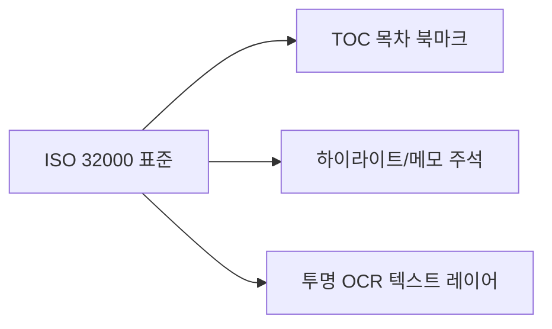

# 17. 참고 (References & Standards) 요약 가이드

## 📋 폴더 개요
국제 표준 사양(PDF ISO 32000), 외부 오픈소스 라이브러리 문서 링크 및 공식 가이드를 보관합니다.

## 📑 하위 문서 목록
| 문서번호 | 파일명 | 문서 제목 | 주요 내용 요약 |
| :--- | :--- | :--- | :--- |
| `17-01` | `17-01_PDF_표준규격_ISO32000_참고.md` | PDF 표준 규격 (ISO 32000) 참고 | Outlines(TOC 북마크), Annotations(주석), 투명 텍스트 레이어 사양 정리 |

