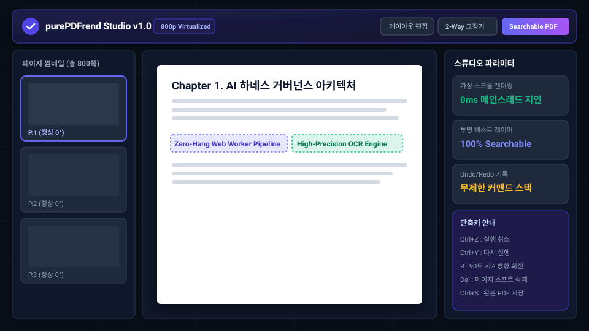
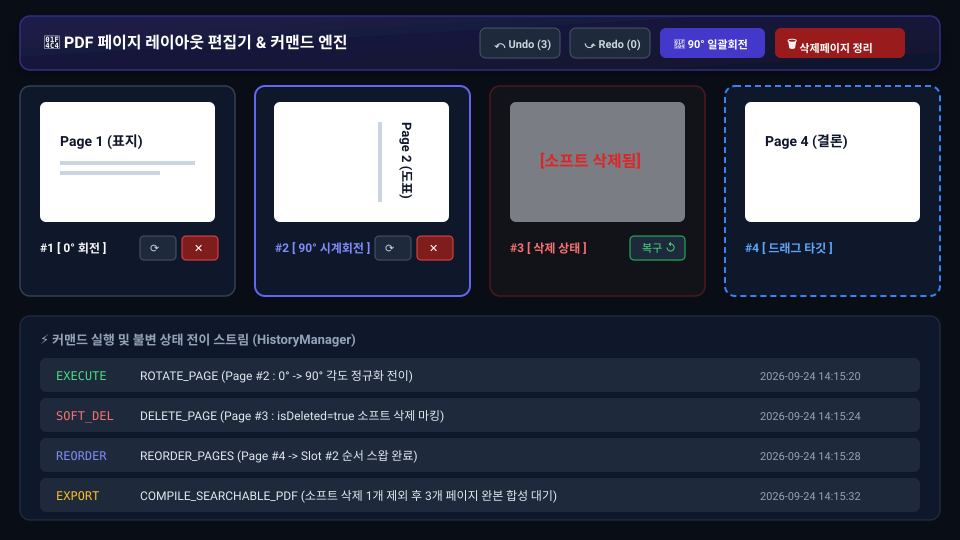
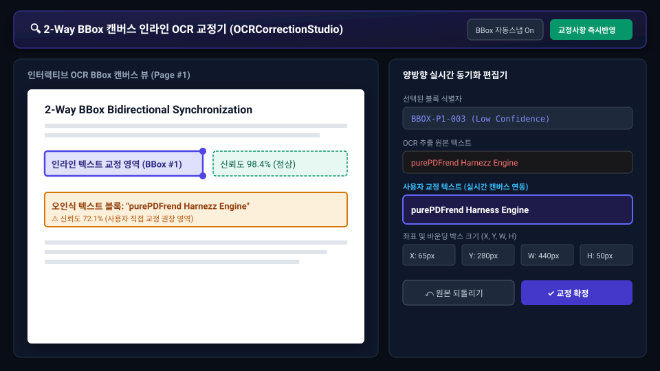
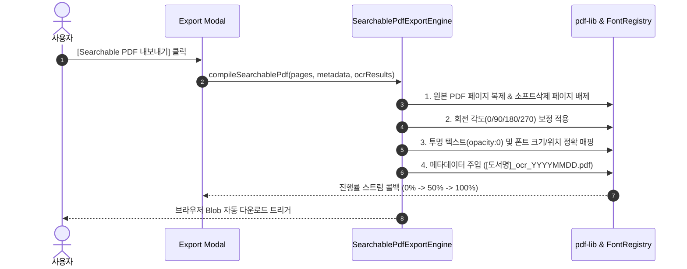

# 18-01. 사용자 PDF 스튜디오 이용 매뉴얼 (User Guide)

> **문서 관리 메타데이터**
> - 문서번호: `MAN-USR-001`
> - 제정일자: 2026-09-24
> - 최근개정: 2026-09-24 (v1.0.0 제정)
> - 책임조직: 플랫폼 프론트엔드 엔지니어링팀 / UIUX 디자인랩
> - 적용범위: `purePDFrend Studio` 웹 인터페이스를 사용하는 모든 일반 사용자 및 문서 편집자
> - 관련 정책 및 설계 문서:
>   - [03-01. 문서 작성 및 편집이력 정책](../03.정책/03-01_문서작성_및_편집이력_정책.md)
>   - [03-13. UI/UX 통일성 및 모바일 반응형 디자인시스템 운영정책](../03.정책/03-13_UIUX_통일성_및_모바일반응형_디자인시스템_운영정책.md)
>   - [05-13. PDF 페이지 레이아웃 편집기 및 Undo/Redo 커맨드 설계](../05.설계/05-13_PDF_페이지_레이아웃_편집기_및_Undo_Redo_커맨드_설계.md)
>   - [05-14. 투명 텍스트 레이어 결합 Searchable PDF 내보내기 엔진 설계](../05.설계/05-14_투명_텍스트_레이어_결합_Searchable_PDF_내보내기_엔진_설계.md)
>   - [15-10. 커맨드 패턴 기반 PDF 무한 실행취소/다시실행 및 불변 상태관리 해설](../15.학습/15-10_커맨드_패턴_기반_PDF_무한_실행취소_다시실행_및_불변_상태관리_해설.md)
>   - [15-11. pdf-lib 기반 투명 텍스트 레이어 임베딩 및 Searchable PDF 생성 기법](../15.학습/15-11_pdf-lib_기반_투명_텍스트_레이어_임베딩_및_Searchable_PDF_생성_기법.md)

---

## 1. 개요 및 화면 인터페이스 소개
**purePDFrend Studio**는 브라우저만으로 800쪽 이상의 대용량 도서 PDF를 멈춤 없이 렌더링하고, 페이지 레이아웃 편집, 실시간 2-Way OCR BBox 텍스트 교정, 투명 텍스트 레이어가 결합된 고품질 Searchable PDF를 원클릭으로 생성·다운로드할 수 있는 올인원 웹 스튜디오입니다.

  
  
<em>[그림 1] purePDFrend Studio v1.0 메인 가상 뷰어 화면</em>

### 1-1. 주요 화면 구성 요소
1. **상단 통합 헤더 & 액션 툴바**:
   - 도서 제목 및 총 페이지 수 표시 (예: `800p Virtualized`)
   - `[레이아웃 편집]`, `[2-Way 교정기]`, `[Searchable PDF 내보내기]` 원클릭 진입 버튼
2. **좌측 페이지 썸네일 가상 네비게이터**:
   - 뷰포트에 표시되는 페이지만 선별 렌더링(Virtual Window)하여 메모리 누수 방지
   - 회전 각도(0°, 90°, 180°, 270°) 및 삭제 상태 실시간 배지 표시
3. **중앙 가상 뷰어 캔버스**:
   - 초고해상도 PDF 벡터 렌더링 및 OCR 투명 텍스트/바운딩 박스(BBox) 인라인 오버레이
4. **우측 파라미터 & 단축키 안내 패널**:
   - 실시간 렌더링 상태 지연 시간(0ms), 텍스트 레이어 인식률, 무제한 실행취소 기록 및 주요 단축키 가이드

---

## 2. 800쪽 대용량 가상 뷰어 활용 가이드

### 2-1. 가상 스크롤 렌더링 (Virtual Slice Rendering)
- 수백 쪽의 PDF를 한 번에 브라우저 DOM에 생성하지 않고, **사용자의 현재 시야에 들어오는 페이지만 실시간 계산**하여 마운트합니다.
- 스크롤을 빠르게 이동하더라도 메인 UI 스레드가 멈추거나 브라우저 탭이 다운되지 않는 **Zero-Hang** 안정성을 제공합니다.

### 2-2. 확대/축소 및 페이지 점프
- 마우스 휠(`Ctrl + Wheel`) 또는 상단 줌 컨트롤(`+`, `-`, `Fit Width`, `100%`)을 통해 배율을 자유롭게 조정할 수 있습니다.
- 상단 페이지 번호 입력창에 원하는 페이지 번호를 입력하고 `Enter`를 누르면 즉시 해당 위치로 부드럽게 스크롤 점프합니다.

---

## 3. 페이지 레이아웃 편집기 및 무제한 Undo/Redo

  
  
<em>[그림 2] PDF 페이지 레이아웃 편집기 및 커맨드 상태 스트림</em>

### 3-1. 페이지 회전 (Rotation 90° / 180° / 270°)
- 각 페이지 카드 우하단의 **회전(⟳)** 버튼을 클릭하거나 단축키 `R`을 누르면 시계 방향으로 90도씩 회전합니다.
- `0° -> 90° -> 180° -> 270° -> 0°` 각도 정규화 모듈로 자동 안전 변환됩니다.

### 3-2. 소프트 삭제(Soft Delete) 및 안전 복구
- 불필요한 페이지의 **삭제(✕)** 버튼 또는 `Delete` 키를 누르면 즉시 삭제되지 않고 **소프트 삭제 상태(isDeleted=true)**로 마킹됩니다.
- 삭제된 페이지는 반투명 붉은색 테두리로 표시되며, 언제든지 **[복구 ↺]** 버튼을 눌러 원상복구할 수 있습니다.
- 상단 툴바의 **[🗑️ 삭제페이지 정리]**를 실행할 때에만 실제 파일에서 일괄 제거(2단계 클린징)됩니다.

### 3-3. 드래그 앤 드롭 (HTML5 Drag & Drop) 순서 재배치
- 페이지 카드를 마우스로 끌어 원하는 위치로 드롭하면 실시간으로 페이지 번호와 순서가 재배열됩니다.

### 3-4. 커맨드 패턴 기반 무제한 Undo / Redo
- 모든 편집 액션(회전, 삭제, 복구, 순서변경)은 불변 스냅샷 커맨드로 스택에 기록됩니다.
- 단축키 `Ctrl + Z` (실행 취소) 및 `Ctrl + Y` 또는 `Ctrl + Shift + Z` (다시 실행)을 통해 무제한으로 이전 상태로 되돌릴 수 있습니다.

---

## 4. 2-Way BBox 캔버스 인라인 OCR 교정기 (OCRCorrectionStudio)

  
  
<em>[그림 3] 2-Way BBox 캔버스 인라인 OCR 교정 인터페이스</em>

### 4-1. 2-Way 양방향 실시간 동기화
- **캔버스 클릭**: 문서 내 오인식된 단어나 문장의 바운딩 박스(BBox)를 클릭하면 우측 편집 패널에 해당 블록의 원본 텍스트와 좌표가 즉시 로드됩니다.
- **인라인 수정**: 우측 입력창에서 교정 텍스트를 입력하면 캔버스 위의 오버레이 텍스트가 실시간으로 동기화 반영됩니다.

### 4-2. 저신뢰도 블록 하이라이트 (Confidence Warning)
- OCR 인식 신뢰도가 80% 미만인 영역은 주황색/경고 색상으로 자동 하이라이트되어 사용자가 손쉽게 교정 대상을 발견할 수 있습니다.

---

## 5. 투명 텍스트 레이어 Searchable PDF 원클릭 내보내기

### 5-1. 완본 Searchable PDF 다운로드 절차
1. 상단 툴바 우측의 보라색 **[Searchable PDF]** 버튼을 클릭합니다.
2. 내보내기 진행 모달창이 나타나며 페이지별 합성 진행률(0% ~ 100%)이 시각화됩니다.
3. 생성이 완료되면 표준 파일명 규격(`[도서제목]_ocr_YYYYMMDD.pdf`)으로 브라우저에 자동 다운로드됩니다.
4. 다운로드된 PDF는 Adobe Acrobat, Chrome, 브라우저 PDF 뷰어 등 어디서나 **텍스트 마우스 드래그, 복사(Ctrl+C), 전문 검색(Ctrl+F)**이 완벽하게 지원됩니다.

---

## 6. 스튜디오 주요 단축키 일람표

| 단축키 | 기능명 | 설명 |
| :--- | :--- | :--- |
| `Ctrl + Z` | 실행 취소 (Undo) | 직전에 수행한 회전, 삭제, 순서변경 등의 편집 작업을 되돌립니다. |
| `Ctrl + Y` / `Ctrl + Shift + Z` | 다시 실행 (Redo) | 실행 취소했던 편집 작업을 다시 복원합니다. |
| `R` | 페이지 회전 (Rotate) | 선택된 페이지를 시계방향으로 90도 회전합니다. |
| `Delete` / `Backspace` | 소프트 삭제 (Soft Delete) | 선택된 페이지를 삭제 목록으로 이동합니다. |
| `Ctrl + S` | 완본 PDF 내보내기 | 현재 편집 및 교정 상태를 반영하여 Searchable PDF를 생성합니다. |
| `Ctrl + +` / `Ctrl + -` | 줌 확대 / 축소 | 캔버스 뷰어의 배율을 확대하거나 축소합니다. |
| `Ctrl + 0` | 100% 원본 배율 | 뷰어 배율을 기본 100% 크기로 리셋합니다. |

---

## 📋 편집 이력 (Revision History)

| 작업일자 | 이슈 | 태스크 | 작업자 | 작업내용 | 사용 AI 모델명 | 에이전트 | 참고링크 |
| :--- | :--- | :--- | :--- | :--- | :--- | :--- | :--- |
| 2026-09-24 | #16 | TASK-0013-01 | gemini | 최초 제정: 사용자 PDF 스튜디오 이용 매뉴얼(v1.0) 작성 | Gemini 3.7 Flash | Google Antigravity | [README_메뉴얼.md](./README_메뉴얼.md) |
