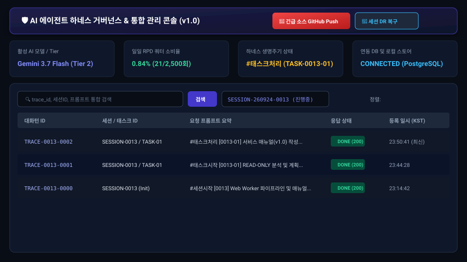
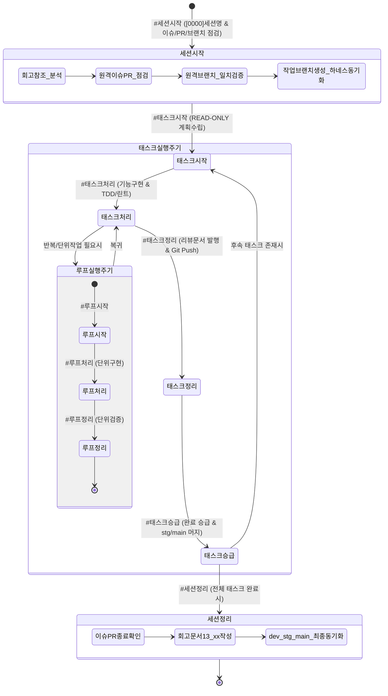
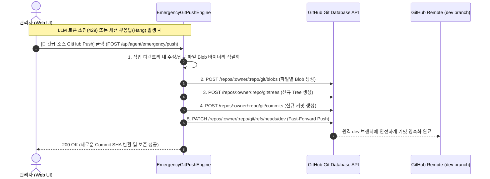

# 18-02. 관리자 하네스 및 시스템 운영 매뉴얼 (Admin & Operations Guide)

> **문서 관리 메타데이터**
> - 문서번호: `MAN-ADM-001`
> - 제정일자: 2026-09-24
> - 최근개정: 2026-09-24 (v1.0.0 제정)
> - 책임조직: 플랫폼 아키텍처 거버넌스 위원회 / SRE 운영센터
> - 적용범위: `purePDFrend` 플랫폼 및 AI 에이전트 하네스를 운영·관리하는 시스템 엔지니어 및 운영자
> - 관련 정책 및 설계 문서:
>   - [03-01. 문서 작성 및 편집이력 정책](../03.정책/03-01_문서작성_및_편집이력_정책.md)
>   - [03-04. 하네스 생명주기 및 상태머신 정책](../03.정책/03-04_하네스_생명주기_및_상태머신_정책.md)
>   - [03-09. 토큰 한도 초과 대화턴 저장 제외 정책](../03.정책/03-09_토큰한도초과_대화턴저장제외_정책.md)
>   - [03-10. DB 장애 대응 및 무중단 운영 정책](../03.정책/03-10_DB장애대응_및_무중단운영_정책.md)
>   - [03-11. 에이전트 통합 거버넌스 및 실행 규제 정책](../03.정책/03-11_에이전트_통합거버넌스_및_실행규제_정책.md)
>   - [03-16. 비-LLM 긴급 푸시 및 세션 재해복구(DR) 운영정책](../03.정책/03-16_비LLM_긴급푸시_및_세션재해복구_DR_운영정책.md)
>   - [03-17. 메타거버넌스 백오피스 및 스냅샷 파일영속화 운영정책](../03.정책/03-17_메타거버넌스_백오피스_및_스냅샷_파일영속화_운영정책.md)

---

## 1. 개요 및 관리자 거버넌스 콘솔 소개
**purePDFrend Admin Governance Console**은 시스템 관리자 및 AI 에이전트 감독관이 실시간으로 하네스 생명주기 전이, 대화턴 추적 텔레메트리, 다차원 토큰 쿼터 번아웃 상태를 모니터링하고, 비상 상황(토큰 고갈, 세션 행, LLM 응답 불능) 시 비-LLM 긴급 Push 및 원클릭 DR 세션 복구를 수행할 수 있는 미션 크리티컬 백오피스입니다.

  
  
<em>[그림 1] purePDFrend 관리자 하네스 거버넌스 콘솔 v1.0</em>

---

## 2. AI 에이전트 하네스 생명주기 거버넌스 (AGENTS.md v2.1)

### 2-1. 하네스 3계층 식별자 체계
- **세션 ID**: `SESSION-YYMMDD-[세션번호 4자리]` (예: `SESSION-260924-0013`)
- **태스크 ID**: `TASK-YYMMDD-[세션번호-태스크번호]` 또는 `TASK-[세션번호-태스크번호]` (예: `TASK-0013-01`)
- **대화턴 ID**: `TRACE-[세션번호-턴번호 4자리]` (예: `TRACE-0013-0002`)
- **루프 ID**: `LOOP-YYMMDD-[세션-태스크-루프번호]` (예: `LOOP-260924-0013-01-01`)

---

## 3. 비-LLM 긴급 GitHub Push 우회로 (Emergency Push Engine)

### 3-1. 사용 시점 및 절차
- **사용 시점**: LLM 모델 쿼터 소진(429 Resource Exhausted), 컨텍스트 초과(15만 토큰 이상), 또는 10분 이상 에이전트 무응답 발생 시.
- **실행 절차**:
  1. 관리자 콘솔 상단 우측의 붉은색 **[🚨 긴급 소스 GitHub Push]** 버튼을 클릭합니다.
  2. 에이전트(LLM)를 일절 거치지 않고 백엔드 `EmergencyGitPushEngine`이 즉각 가동되어 현재 작업 중인 모든 코드와 문서를 GitHub 원격 `dev` 브랜치에 신규 커밋으로 안전하게 푸시합니다.

---

## 4. 세션 재해복구(DR) 및 스냅샷 자동 클린징

### 4-1. `#세션복구` 명령어 규약
- 새 창을 열거나 세션을 인계받을 때 `#세션복구` 프롬프트를 인입합니다.
  - **스냅샷 1건**: 최신 스냅샷 대상으로 직결 복구 자동 전개.
  - **스냅샷 다건**: 복구 가능한 세션 목록을 반환하고 사용자 선택 유도.
  - **특정 타깃 복구**: `#세션복구:SESSION-260924-0013` 형식으로 즉각 지정 복원.

### 4-2. 스냅샷 중복방지 및 클린징
- 재해복구 시 동일 세션 내 중복된 스냅샷은 타임스탬프 기반으로 자동 클린징되며, DB 및 `local_agent_store.json`에 최신 상태만 단일화되어 무결성이 보장됩니다.

---

## 5. 3-Tier 모델 라우팅 및 다차원 쿼터 거버넌스 (GEMINI.md)

| 티어 (Tier) | 모델명 | 일일 한도 (RPD) | 배정 하네스 단계 및 용도 | 지능형 폴백 전략 |
| :--- | :--- | :---: | :--- | :--- |
| **Tier 1 (Heavy)** | `gemini-1.5-pro` | **250회/일** | `#태스크시작` (심층 아키텍처, DDD/헥사고날 설계) | 250회 도달 시 Flash로 즉각 자동 폴백 |
| **Tier 2 (Standard)** | `gemini-1.5-flash` | **2,500회/일** | `#태스크처리` (기능 구현, TDD 단위 테스트, 린트 보정) | 대용량 코드 생성 및 빠른 반복 |
| **Tier 3 (Lightweight)**| `gemini-1.5-flash-8b` / `flash-lite` | **4,000회/일** | `#태스크정리`, `#태스크승급`, 문서 인덱싱, 상태 동기화 | 불필요한 Pro/Flash 쿼터 낭비 방어 |

- **토큰 리셋 기준**: 한국 표준시(KST) 매일 **16:00 (PST 00:00)**에 자동 리셋됩니다.
- **토큰 한도 초과 오류(429, RESOURCE_EXHAUSTED) 격리**:
  - 429 오류 응답은 `TokenQuotaDetectionService`를 통해 사전 차단되어 대화 추적 DB 및 사용량 집계에 절대 포함되지 않습니다.

---

## 6. 대화턴 추적 텔레메트리 콘솔 가이드

### 6-1. 대화턴 목록 정렬 및 검색
- **기본 정렬**: 최신 대화턴이 최상단에 오도록 **등록일자 내림차순(`created_at Desc`)**으로 기본 정렬됩니다.
- **세션별 격리 필터**: 상단 세션 드롭다운을 통해 특정 세션(`SESSION-260924-0013` 등)의 대화턴만 즉시 필터링할 수 있습니다.
- **키워드 검색 & 엔터 연동**: 검색창에 `trace_id`, 세션ID, 프롬프트, 응답 내용을 입력하고 `Enter` 키 또는 **[검색]** 버튼을 누르면 실시간 검색이 수행됩니다.
- **원클릭 복사**: 프롬프트 및 응답 코드 블록 우측의 복사 버튼을 눌러 손쉽게 클립보드로 복사할 수 있습니다.

---

## 📋 편집 이력 (Revision History)

| 작업일자 | 이슈 | 태스크 | 작업자 | 작업내용 | 사용 AI 모델명 | 에이전트 | 참고링크 |
| :--- | :--- | :--- | :--- | :--- | :--- | :--- | :--- |
| 2026-09-24 | #16 | TASK-0013-01 | gemini | 최초 제정: 관리자 하네스 및 시스템 운영 매뉴얼(v1.0) 작성 | Gemini 3.7 Flash | Google Antigravity | [README_메뉴얼.md](./README_메뉴얼.md) |
