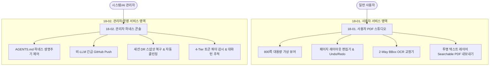

# 18. purePDFrend 서비스 매뉴얼 (Manuals)

> **문서 관리 메타데이터**
> - 문서번호: `MAN-IDX-001`
> - 제정일자: 2026-09-24
> - 최근개정: 2026-09-24 (v1.0.0 제정)
> - 책임조직: 플랫폼 아키텍처 거버넌스 위원회 / 서비스 운영팀
> - 적용범위: `purePDFrend` 전 서비스 사용자 및 시스템/AI 거버넌스 관리자
> - 관련 문서:
>   - [03-01. 문서 작성 및 편집이력 정책](../03.정책/03-01_문서작성_및_편집이력_정책.md)
>   - [03-11. 에이전트 통합 거버넌스 및 실행 규제 정책](../03.정책/03-11_에이전트_통합거버넌스_및_실행규제_정책.md)
>   - [05-13. PDF 페이지 레이아웃 편집기 및 Undo/Redo 커맨드 설계](../05.설계/05-13_PDF_페이지_레이아웃_편집기_및_Undo_Redo_커맨드_설계.md)
>   - [05-14. 투명 텍스트 레이어 결합 Searchable PDF 내보내기 엔진 설계](../05.설계/05-14_투명_텍스트_레이어_결합_Searchable_PDF_내보내기_엔진_설계.md)
>   - [11-01. 서비스 배포 및 운영 가이드](../11.운영/11-01_서비스_배포_및_운영_가이드.md)

---

## 1. 개요 및 목적
본 `18.메뉴얼` 디렉터리는 **purePDFrend** 솔루션의 최종 사용자를 위한 **PDF 스튜디오 이용 매뉴얼**과 시스템 운영자 및 개발자를 위한 **AI 거버넌스 하네스 운영 매뉴얼**을 체계적으로 제공합니다.  
모든 매뉴얼은 실제 동작하는 브라우저 UI 화면 캡처 및 아키텍처 다이어그램을 기반으로 작성되었으며, 버전 릴리즈와 함께 지속적으로 현행화됩니다.

---

## 2. 매뉴얼 체계 및 버전 현황표

| 매뉴얼 번호 | 매뉴얼 명칭 | 주요 대상 | 주요 핵심 기능 및 설명 | 최신 버전 | 상태 |
| :--- | :--- | :--- | :--- | :---: | :---: |
| [18-01](./18-01_사용자_PDF_스튜디오_이용_매뉴얼.md) | **사용자 PDF 스튜디오 이용 매뉴얼** | 일반 사용자, 편집자 | 800쪽 대용량 가상 뷰어, 페이지 레이아웃 편집기 (회전/삭제/재정렬/무제한 Undo·Redo), 2-Way BBox OCR 교정기, 투명 텍스트 레이어 Searchable PDF 원클릭 다운로드 | `v1.0.0` | ✅ 최신 현행화 |
| [18-02](./18-02_관리자_하네스_및_시스템_운영_매뉴얼.md) | **관리자 하네스 및 시스템 운영 매뉴얼** | 시스템 관리자, AI 엔지니어 | AI 에이전트 하네스 거버넌스(세션/태스크/루프 상태머신), 비-LLM 긴급 GitHub Push 우회로, 세션 재해복구(DR) 스냅샷 복원 및 자동 클린징, 4-Tier 텔레메트리 쿼터 감시, 대화턴 추적 | `v1.0.0` | ✅ 최신 현행화 |

---

## 3. 매뉴얼별 핵심 기능 다이어그램

---

## 4. 이미지 및 화면 캡처 자산 관리 정책
- 모든 화면 캡처 및 아키텍처 다이어그램은 `docs/18.메뉴얼/images/` 하위에 배치합니다.
- 파일명은 `v{버전}_{YYMMDD}_{기능명}.svg` 또는 `.png` 형식을 준수하여 버전별 변경 이력을 추적할 수 있도록 관리합니다.

  
  
<em>[그림 18-1] purePDFrend Studio v1.0 통합 인터페이스 개요</em>

---

## 5. DB 영속화 및 동기화 원칙
- 본 매뉴얼 문서는 Git 저장소와 개발 DB `purepdfrend_dev.aiagent.agent_docs_meta` 테이블에 1:1로 매핑 및 영속화됩니다.
- 신규 매뉴얼 발행 및 개정 시 `scripts/sync_data_and_traces.ts` 또는 하네스 동기화 엔진을 통해 SHA-256 해시와 메타데이터가 자동 갱신됩니다.

---

## 📋 편집 이력 (Revision History)

| 작업일자 | 이슈 | 태스크 | 작업자 | 작업내용 | 사용 AI 모델명 | 에이전트 | 참고링크 |
| :--- | :--- | :--- | :--- | :--- | :--- | :--- | :--- |
| 2026-09-24 | #16 | TASK-0013-01 | gemini | 최초 제정: docs/18.메뉴얼 체계 신설 및 README_메뉴얼.md 인덱스 작성 | Gemini 3.7 Flash | Google Antigravity | [03-01. 문서 정책](../03.정책/03-01_문서작성_및_편집이력_정책.md) |
